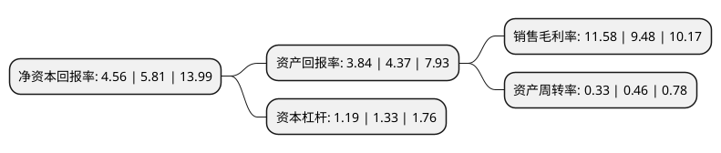

> 本页面由自动化程序生成于 2022年5月20日 01:41
> 内容可能存在错误，如有bug请提交issue至：https://github.com/Eroleice/doc-pi/issues
{.is-warning}

# 上市公司基本情况

## 基本资料

恒拓开源信息科技股份有限公司（以下简称“恒拓开源”）成立于2007年06月27日，郑州市。于2020年07月27日在北交所北交所上市。

恒拓开源注册资本13,770.199万元，为企业客户提供软件开源化技术开发，技术咨询服务，为各大机场铺设无线移动宽带专网并向客户收取相关服务费用，出售和租赁软件及终端等。以下是详细信息：

- 公司名称: 恒拓开源信息科技股份有限公司
- 股票代码: 834415.BJ
- 所在地: 河南 - 郑州市
- 成立日期: 2007年06月27日
- 注册资本: 13,770.199万元
- 法定代表人: 武洲
- 主营业务: 为企业客户提供软件开源化技术开发，技术咨询服务，为各大机场铺设无线移动宽带专网并向客户收取相关服务费用，出售和租赁软件及终端等
- 公司官网: www.foreveross.com
- 公司介绍: 公司是一家从事行业应用软件开发和专业技术服务的供应商，主要为航空公司、机场及民航保障企业提供安全自主可控的软件服务及整体解决方案。在民用航空信息化领域，公司主要产品分为智慧航空公司系列产品和智慧机场系列产品两大类。公司通过多年努力已经成为保障我国民航业安全运行的核心软件供应商之一，同时也是Sabre、Jeppesen等国外软件厂商在我国民航信息化安全运行领域的可靠替代者。

## 股东及高管情况

上市公司第一大股东为北京盈辉互联科技有限公司，持股22,854,384股，占比16.6%，**疑似为**上市公司实际控制人。

截至2022年03月31日，上市公司的前十大股东中，共有6名自然人股东，4名机构股东，其中5%以上大股东共有4名。上市公司前十大股东明细如下：

> 未能通过持股比例判定出上市公司实际控制人（持股30%以上）
> 可能存在通过间接持股、联合持股、协议控制等方式拥有实际控制权的主体，具体请参考上市公司定期公告！
{.is-warning}

> 截至2022年03月31日，上市公司前十大股东信息如下：

| 股东名称 | 持股数量（股） | 持股比例 |
| --- | --- | --- |
| 北京盈辉互联科技有限公司 | 22,854,384 | 16.6% |
| 西藏智航交通科技有限公司 | 21,348,824 | 15.5% |
| 马越 | 9,891,882 | 7.18% |
| 北京亚邦伟业技术有限公司 | 8,445,945 | 6.13% |
| 北京朗润益发投资咨询中心(有限合伙) | 4,101,532 | 2.98% |
| 刘良红 | 2,831,328 | 2.06% |
| 谭汉钊 | 2,373,081 | 1.72% |
| 田依禾 | 1,949,722 | 1.42% |
| 薛卫兵 | 1,660,000 | 1.21% |
| 武洲 | 1,513,430 | 1.1% |

## 利润表分析

上市公司2021年总收入为1.95亿元，净利润为0.22亿元，实现盈利。

## 杜邦分析

> 数据列示周期：2021年 | 2020年 | 2019年
{.is-info}

上市公司的净资产收益率在近一年有所下降，下降幅度为-21.51%，其变化情况分解如下：
- 上市公司的销售毛利率在近一年上升了22.15%，可能是生产效率的提升、商品原材料价格下跌或商品价格的上涨所致。
- 上市公司的资产周转率在近一年下降了-28.26%，可能是源自于更慢的销售回款或库存管理效果下降。
- 上市公司的财务杠杆比率在近一年下降了-10.53%，可能是减少负债降低财务费用。

