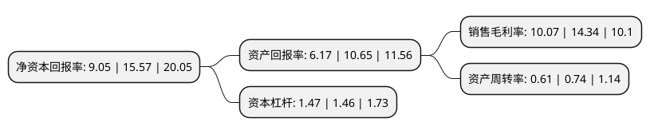

> 本页面由自动化程序生成于 2022年5月20日 01:41
> 内容可能存在错误，如有bug请提交issue至：https://github.com/Eroleice/doc-pi/issues
{.is-warning}

# 上市公司基本情况

## 基本资料

三门三友科技股份有限公司（以下简称“三友科技”）成立于2002年02月21日，台州市。于2020年07月27日在北交所北交所上市。

三友科技注册资本10,296万元，冶金工程技术研发，化学工程研发，冶金专用设备，化工专用设备，机电设备研发，制造，安装，维护保养，维修，技术服务;货物和技术进出口以下是详细信息：

- 公司名称: 三门三友科技股份有限公司
- 股票代码: 834475.BJ
- 所在地: 浙江 - 台州市
- 成立日期: 2002年02月21日
- 注册资本: 10,296万元
- 法定代表人: 吴用
- 主营业务: 冶金工程技术研发，化学工程研发，冶金专用设备，化工专用设备，机电设备研发，制造，安装，维护保养，维修，技术服务;货物和技术进出口
- 公司官网: www.sanyouco.com
- 公司介绍: 公司专注于有色金属电化学精炼专用新型电极材料及成套智能装备的研发、生产和销售。公司产品主要分为阴极板和机组设备两大类，公司研发生产的有色金属精炼设备在产品质量、性能等方面具有较强的竞争优势，赢得了客户的信赖和好评。经过多年的经营，凭借公司自身优良的产品质量、性能和及时完善的售后服务，“三友”品牌在有色金属电化学精炼专用新型电极材料及成套智能装备领域已经具有较强的市场影响力和品牌美誉度。

## 股东及高管情况

上市公司第一大股东为吴用，持股35,873,836股，占比34.84%，为上市公司实际控制人。

截至2022年03月31日，上市公司的前十大股东中，共有10名自然人股东，其中5%以上大股东共有3名。上市公司前十大股东明细如下：

> 截至2022年03月31日，上市公司前十大股东信息如下：

| 股东名称 | 持股数量（股） | 持股比例 |
| --- | --- | --- |
| 吴用 | 35,873,836 | 34.84% |
| 吴俊义 | 23,373,000 | 22.7% |
| 李彩球 | 14,040,000 | 13.64% |
| 何书军 | 1,059,399 | 1.03% |
| 刘林 | 570,900 | 0.55% |
| 陈顺保 | 540,000 | 0.52% |
| 梁建明 | 530,100 | 0.51% |
| 朱春晓 | 464,874 | 0.45% |
| 吴英芝 | 309,080 | 0.3% |
| 石棱煜 | 295,900 | 0.29% |

## 利润表分析

上市公司2021年总收入为2.87亿元，净利润为0.28亿元，实现盈利。

## 杜邦分析

> 数据列示周期：2021年 | 2020年 | 2019年
{.is-info}

上市公司的净资产收益率在近一年有所下降，下降幅度为-41.88%，其变化情况分解如下：
- 上市公司的销售毛利率在近一年下降了-29.78%，可能是生产效率的下降、商品原材料价格上涨或商品价格的下跌所致。
- 上市公司的资产周转率在近一年下降了-17.57%，可能是源自于更慢的销售回款或库存管理效果下降。
- 上市公司的财务杠杆比率在近一年上升了0.68%，可能是增加负债扩大生产规模。

