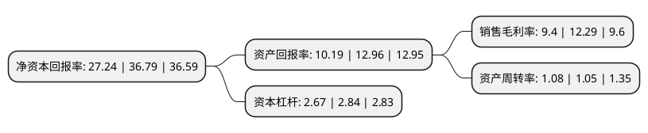

> 本页面由自动化程序生成于 2022年5月20日 01:41
> 内容可能存在错误，如有bug请提交issue至：https://github.com/Eroleice/doc-pi/issues
{.is-warning}

# 上市公司基本情况

## 基本资料

陕西同力重工股份有限公司（以下简称“同力股份”）成立于2005年02月01日，西安市。于2021年02月22日在北交所北交所上市。

同力股份注册资本45,252.5万元，公司主要产品为TL85，TL87，TL88，新能源等系列非公路宽体自卸车，同时还生产TLD系列非公路矿用自卸车，坑道车，工程洒水车，桥梁运输车，运煤车等工程机械产品。从应用行业划分，产品应用于露天煤矿，铁矿，有色金属矿，水泥建材等矿山及水利水电等各类大型工程工地;从应用地域划分，产品覆盖了我国多个省份，并已拓展出口至巴基斯坦，印度尼西亚，马来西亚，蒙古，俄罗斯，塔吉克斯坦，印度等多个国家和地区。以下是详细信息：

- 公司名称: 陕西同力重工股份有限公司
- 股票代码: 834599.BJ
- 所在地: 陕西 - 西安市
- 成立日期: 2005年02月01日
- 注册资本: 45,252.5万元
- 法定代表人: 叶磊
- 主营业务: 公司主要产品为TL85，TL87，TL88，新能源等系列非公路宽体自卸车，同时还生产TLD系列非公路矿用自卸车，坑道车，工程洒水车，桥梁运输车，运煤车等工程机械产品从应用行业划分，产品应用于露天煤矿，铁矿，有色金属矿，水泥建材等矿山及水利水电等各类大型工程工地;从应用地域划分，产品覆盖了我国多个省份，并已拓展出口至巴基斯坦，印度尼西亚，马来西亚，蒙古，俄罗斯，塔吉克斯坦，印度等多个国家和地区
- 公司官网: www.sntonly.com
- 公司介绍: 公司是一家专业生产非公路用车的高新技术企业。主营业务为重工机械产品的开发、制造、销售、修理、租赁及配件销售，主导产品为TL840、TL850、TL860系列非公路自卸车，同时，公司生产少量桥梁运输车、工程洒水车、坑道车等非公路工程运输机械。同力重工牌非公路用车现已形成40T、50T、60T三大系列，30多个产品品种，在中国已广泛应用于各类矿山、水电工地、大型工程。公司是国家火炬计划重点高新技术企业，建有中国最大的非公路用车生产基地，是非公路用车行业的开创者和领导者。

## 股东及高管情况

上市公司第一大股东为叶磊，持股80,966,629股，占比17.8922%，**疑似为**上市公司实际控制人。

截至2022年05月16日，上市公司的前十大股东中，共有5名自然人股东，5名机构股东，其中5%以上大股东共有10名。上市公司前十大股东明细如下：

> 未能通过持股比例判定出上市公司实际控制人（持股30%以上）
> 可能存在通过间接持股、联合持股、协议控制等方式拥有实际控制权的主体，具体请参考上市公司定期公告！
{.is-warning}

> 截至2022年05月16日，上市公司前十大股东信息如下：

| 股东名称 | 持股数量（股） | 持股比例 |
| --- | --- | --- |
| 叶磊 | 80,966,629 | 17.8922% |
| 叶磊 | 80,966,629 | 17.8922% |
| 陕西华岳机械设备有限公司 | 76,941,479 | 17.0027% |
| 陕西华岳机械设备有限公司 | 76,941,479 | 17.0027% |
| 陕西华岳机械设备有限公司 | 76,941,479 | 17.0027% |
| 许亚楠 | 59,704,293 | 13.1936% |
| 许亚楠 | 59,704,293 | 13.1936% |
| 许亚楠 | 59,704,293 | 13.1936% |
| 苏州松禾成长创业投资中心(有限合伙) | 36,078,293 | 7.9727% |
| 苏州松禾成长创业投资中心(有限合伙) | 36,078,293 | 7.9727% |

## 利润表分析

上市公司2021年总收入为40.94亿元，净利润为3.84亿元，实现盈利。

## 杜邦分析

> 数据列示周期：2021年 | 2020年 | 2019年
{.is-info}

上市公司的净资产收益率在近一年有所下降，下降幅度为-25.96%，其变化情况分解如下：
- 上市公司的销售毛利率在近一年下降了-23.52%，可能是生产效率的下降、商品原材料价格上涨或商品价格的下跌所致。
- 上市公司的资产周转率在近一年上升了2.86%，可能是源自于更快的销售回款或库存管理效果提升。
- 上市公司的财务杠杆比率在近一年下降了-5.99%，可能是减少负债降低财务费用。

