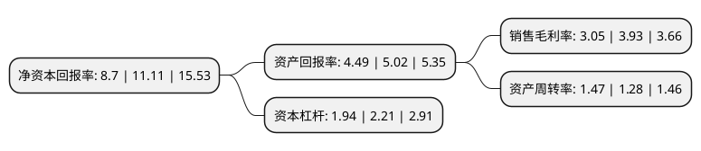

> 本页面由自动化程序生成于 2022年5月20日 01:41
> 内容可能存在错误，如有bug请提交issue至：https://github.com/Eroleice/doc-pi/issues
{.is-warning}

# 上市公司基本情况

## 基本资料

宁波球冠电缆股份有限公司（以下简称“球冠电缆”）成立于2006年12月22日，宁波市。于2020年07月27日在北交所北交所上市。

球冠电缆注册资本20,800万元，电线，电缆制造以下是详细信息：

- 公司名称: 宁波球冠电缆股份有限公司
- 股票代码: 834682.BJ
- 所在地: 浙江 - 宁波市
- 成立日期: 2006年12月22日
- 注册资本: 20,800万元
- 法定代表人: 陈永明
- 主营业务: 电线，电缆制造
- 公司官网: www.qrunning.com
- 公司介绍: 公司是从事电线电缆研发、生产、销售的专业企业，目前公司主要产品为500kV及以下级别电线电缆，产品应用涉及电力、能源、交通、智能装备、石化、冶金、工矿、通讯、建筑工程等多个领域。公司在多年的电线电缆产品研制、生产过程中，始终坚持以满足社会发展需要为己任，在电力电缆、特种电缆、裸电线、电气装备用电线电缆等产品上形成了成熟的技术和经验，配置了先进的生产、试验与检验设备，储备了各类管理、开发、检验、生产人才。公司不断引进、消化、吸收国外先进制造技术，在此基础上持续进行自主创新和产品开发，开发了轨道交通特种电缆、高压及超高压交联电力电缆，超高压纳米材料直流电缆、军用稳相电缆、新能源及智能装备线缆等一系列产品，为公司的持续发展奠定了良好的基础。

## 股东及高管情况

上市公司第一大股东为宁波北仑托马斯投资有限公司，持股41,769,000股，占比20.08%，**疑似为**上市公司实际控制人。

截至2022年03月31日，上市公司的前十大股东中，共有5名自然人股东，5名机构股东，其中5%以上大股东共有3名。上市公司前十大股东明细如下：

> 未能通过持股比例判定出上市公司实际控制人（持股30%以上）
> 可能存在通过间接持股、联合持股、协议控制等方式拥有实际控制权的主体，具体请参考上市公司定期公告！
{.is-warning}

> 截至2022年03月31日，上市公司前十大股东信息如下：

| 股东名称 | 持股数量（股） | 持股比例 |
| --- | --- | --- |
| 宁波北仑托马斯投资有限公司 | 41,769,000 | 20.08% |
| 天地国际控股有限公司 | 39,000,000 | 18.75% |
| 宁波兴邦投资咨询有限公司 | 32,591,000 | 15.67% |
| 陈永明 | 10,286,900 | 4.95% |
| 宁波市北仑明邦投资咨询有限公司 | 4,030,000 | 1.94% |
| 潘申明 | 2,240,196 | 1.08% |
| 庄鸿国 | 2,139,558 | 1.03% |
| 孙亚芬 | 1,300,650 | 0.63% |
| 沈文峰 | 1,210,099 | 0.58% |
| 国信证券股份有限公司 | 1,147,342 | 0.55% |

## 利润表分析

上市公司2021年总收入为26.88亿元，净利润为0.82亿元，实现盈利。

## 杜邦分析

> 数据列示周期：2021年 | 2020年 | 2019年
{.is-info}

上市公司的净资产收益率在近一年有所下降，下降幅度为-21.69%，其变化情况分解如下：
- 上市公司的销售毛利率在近一年下降了-22.39%，可能是生产效率的下降、商品原材料价格上涨或商品价格的下跌所致。
- 上市公司的资产周转率在近一年上升了14.84%，可能是源自于更快的销售回款或库存管理效果提升。
- 上市公司的财务杠杆比率在近一年下降了-12.22%，可能是减少负债降低财务费用。

