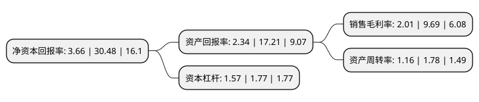

> 本页面由自动化程序生成于 2022年5月20日 01:41
> 内容可能存在错误，如有bug请提交issue至：https://github.com/Eroleice/doc-pi/issues
{.is-warning}

# 上市公司基本情况

## 基本资料

深圳市美之高科技股份有限公司（以下简称“美之高”）成立于2002年07月08日，深圳市。于2021年07月05日在北交所北交所上市。

美之高注册资本6,961.304万元，主要产品有塑胶制品，五金制品，木器制品，竹制品，藤制品，柳制品，布制品，产品广泛运用于工业，商业及家庭等。以下是详细信息：

- 公司名称: 深圳市美之高科技股份有限公司
- 股票代码: 834765.BJ
- 所在地: 广东 - 深圳市
- 成立日期: 2002年07月08日
- 注册资本: 6,961.304万元
- 法定代表人: 黄华侨
- 主营业务: 主要产品有塑胶制品，五金制品，木器制品，竹制品，藤制品，柳制品，布制品，产品广泛运用于工业，商业及家庭等
- 公司官网: www.meizhigao.cn
- 公司介绍: 公司主要研发、生产、销售以金属置物架为主的收纳产品，经过多年发展，目前已经形成集自主研发、生产、销售、仓储物流为一体的综合服务体系。公司主要提供家用、工业用收纳产品及设计方案，坚持以DIY理念为核心，并结合木、布、藤、塑胶、纸类等配件组成的各类收纳产品。公司现已经拥有成熟的收纳产品的开发、生产制造和质量控制技术，公司采用的核心技术主要是通过自主研发及经验积累而成.下设深圳市美高塑胶金属制品有限公司(制造基地)、美之顺五金塑胶制品有限公司(加工中心)、美之高实业发展有限公司(营销中心)、通之泰贸易有限公司(进出口贸易)四家子公司。先后在北京、上海、广州、成都等地设立分支机构。

## 股东及高管情况

上市公司第一大股东为黄华侨，持股21,500,000股，占比30.89%，为上市公司实际控制人。

截至2022年03月31日，上市公司的前十大股东中，共有5名自然人股东，3名机构股东，2个产品账户，其中5%以上大股东共有4名。上市公司前十大股东明细如下：

> 截至2022年03月31日，上市公司前十大股东信息如下：

| 股东名称 | 持股数量（股） | 持股比例 |
| --- | --- | --- |
| 黄华侨 | 21,500,000 | 30.89% |
| 蔡秀莹 | 10,154,331 | 14.59% |
| 深圳市华汇通鼎投资合伙企业(有限合伙) | 10,000,000 | 14.37% |
| 新余美高投资管理中心(有限合伙) | 5,000,000 | 7.18% |
| 宁波梅山保税港区福鹏宏祥玖号股权投资管理中心(有限合伙) | 2,950,000 | 4.24% |
| 黄佳茵 | 2,500,000 | 3.59% |
| 吴志泽 | 1,750,000 | 2.51% |
| 王海平 | 614,610 | 0.88% |
| 深圳市纵贯资本管理有限公司-纵贯稳健一号私募证券投资基金 | 596,623 | 0.86% |
| 深圳市丹桂顺资产管理有限公司-丹桂顺之实事求是肆号私募基金 | 320,000 | 0.46% |

## 利润表分析

上市公司2021年总收入为5.01亿元，净利润为0.1亿元，实现盈利。

## 杜邦分析

> 数据列示周期：2021年 | 2020年 | 2019年
{.is-info}

上市公司的净资产收益率在近一年有所下降，下降幅度为-87.99%，其变化情况分解如下：
- 上市公司的销售毛利率在近一年下降了-79.26%，可能是生产效率的下降、商品原材料价格上涨或商品价格的下跌所致。
- 上市公司的资产周转率在近一年下降了-34.83%，可能是源自于更慢的销售回款或库存管理效果下降。
- 上市公司的财务杠杆比率在近一年下降了-11.3%，可能是减少负债降低财务费用。

