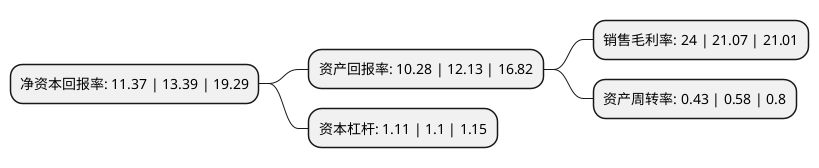

> 本页面由自动化程序生成于 2022年5月20日 01:41
> 内容可能存在错误，如有bug请提交issue至：https://github.com/Eroleice/doc-pi/issues
{.is-warning}

# 上市公司基本情况

## 基本资料

北京凯德石英股份有限公司（以下简称“凯德石英”）成立于1997年01月15日，北京市。于2022年03月04日在北交所北交所上市。

凯德石英注册资本7,500万元，石英仪器，石英管道，石英舟等石英玻璃制品的研发，生产和销售以下是详细信息：

- 公司名称: 北京凯德石英股份有限公司
- 股票代码: 835179.BJ
- 所在地: 北京 - 北京市
- 成立日期: 1997年01月15日
- 注册资本: 7,500万元
- 法定代表人: 张忠恕
- 主营业务: 石英仪器，石英管道，石英舟等石英玻璃制品的研发，生产和销售
- 公司官网: www.kaidequartz.com
- 公司介绍: 公司是国内领先的石英玻璃制品加工企业，主营业务为石英仪器、石英管道、石英舟等石英玻璃制品的研发、生产和销售。公司在石英玻璃加工技术方面具有长期的积累和沉淀，在半导体集成电路芯片用石英玻璃制品领域，公司是国内少数能为8、12英寸芯片生产线加工配套石英玻璃制品的企业之一。公司的主要产品包括石英仪器、石英管道、石英舟等石英玻璃制品。

## 股东及高管情况

上市公司第一大股东为张忠恕，持股14,393,900股，占比19.1919%，**疑似为**上市公司实际控制人。

截至2022年05月10日，上市公司的前十大股东中，共有3名自然人股东，7名机构股东，其中5%以上大股东共有4名。上市公司前十大股东明细如下：

> 未能通过持股比例判定出上市公司实际控制人（持股30%以上）
> 可能存在通过间接持股、联合持股、协议控制等方式拥有实际控制权的主体，具体请参考上市公司定期公告！
{.is-warning}

> 截至2022年05月10日，上市公司前十大股东信息如下：

| 股东名称 | 持股数量（股） | 持股比例 |
| --- | --- | --- |
| 张忠恕 | 14,393,900 | 19.1919% |
| 王毓敏 | 7,946,000 | 10.5947% |
| 北京德益诚投资发展中心(有限合伙) | 6,840,000 | 9.12% |
| 江苏太平洋石英股份有限公司 | 5,960,000 | 7.9467% |
| 新余川流投资管理有限公司-分宜川流长枫新材料投资合伙企业(有限合伙) | 3,598,000 | 4.7973% |
| 李燕霞 | 3,303,000 | 4.404% |
| 北京亦庄国际产业投资管理有限公司-北京亦庄国际新兴产业投资中心(有限合伙) | 2,000,000 | 2.6667% |
| 北京英凯石英投资发展中心(有限合伙) | 1,900,000 | 2.5333% |
| 北京中兴通远投资股份有限公司 | 1,672,400 | 2.2299% |
| 青岛民和德元创业投资管理中心(有限合伙)-青岛民芯投资中心(有限合伙) | 1,550,000 | 2.0667% |

## 利润表分析

上市公司2021年总收入为1.65亿元，净利润为0.39亿元，实现盈利。

## 杜邦分析

> 数据列示周期：2021年 | 2020年 | 2019年
{.is-info}

上市公司的净资产收益率在近一年有所下降，下降幅度为-15.09%，其变化情况分解如下：
- 上市公司的销售毛利率在近一年上升了13.91%，可能是生产效率的提升、商品原材料价格下跌或商品价格的上涨所致。
- 上市公司的资产周转率在近一年下降了-25.86%，可能是源自于更慢的销售回款或库存管理效果下降。
- 上市公司的财务杠杆比率在近一年上升了0.91%，可能是增加负债扩大生产规模。

