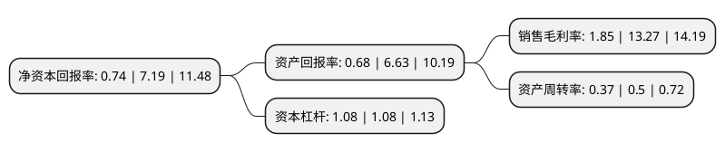

> 本页面由自动化程序生成于 2022年5月20日 01:41
> 内容可能存在错误，如有bug请提交issue至：https://github.com/Eroleice/doc-pi/issues
{.is-warning}

# 上市公司基本情况

## 基本资料

北京世纪国源科技股份有限公司（以下简称“国源科技”）成立于2005年10月24日，北京市。于2020年07月27日在北交所北交所上市。

国源科技注册资本13,379万元，地理信息数据工程，行业应用软件开发，空间信息应用服务以下是详细信息：

- 公司名称: 北京世纪国源科技股份有限公司
- 股票代码: 835184.BJ
- 所在地: 北京 - 北京市
- 成立日期: 2005年10月24日
- 注册资本: 13,379万元
- 法定代表人: 董利成
- 主营业务: 地理信息数据工程，行业应用软件开发，空间信息应用服务
- 公司官网: www.gykj.com.cn
- 公司介绍: 公司专注于地理信息和农业大数据领域，以地理信息开发应用为核心，通过将3S技术与云计算、大数据、人工智能等现代信息技术相结合，向客户提供地理信息数据工程、行业应用软件开发和空间信息应用服务等业务。公司具有较强的时空数据处理建库、软件开发与应用服务能力，并积累了丰富的行业经验，在自然资源、农业农村空间信息化领域具有较强的竞争优势。公司是高新技术企业。公司及子公司拥有摄影测量与遥感、地理信息系统工程、工程测量、不动产测绘专业甲级测绘资质，地图编制、测绘航空摄影、互联网地图服务。

## 股东及高管情况

上市公司第一大股东为董利成，持股26,456,982股，占比19.78%，**疑似为**上市公司实际控制人。

截至2022年03月31日，上市公司的前十大股东中，共有7名自然人股东，2名机构股东，1个产品账户，其中5%以上大股东共有4名。上市公司前十大股东明细如下：

> 未能通过持股比例判定出上市公司实际控制人（持股30%以上）
> 可能存在通过间接持股、联合持股、协议控制等方式拥有实际控制权的主体，具体请参考上市公司定期公告！
{.is-warning}

> 截至2022年03月31日，上市公司前十大股东信息如下：

| 股东名称 | 持股数量（股） | 持股比例 |
| --- | --- | --- |
| 董利成 | 26,456,982 | 19.78% |
| 李景艳 | 17,067,600 | 12.76% |
| 董利国 | 10,116,000 | 7.56% |
| 刘代 | 7,810,100 | 5.84% |
| 北京世纪国源科技股份有限公司回购专用证券账户 | 3,130,973 | 2.34% |
| 唐巍 | 2,673,391 | 2% |
| 李娜 | 2,201,000 | 1.65% |
| 安徽同创安元股权投资合伙企业(有限合伙) | 2,000,000 | 1.49% |
| 深圳同创锦程新三板投资企业(有限合伙) | 2,000,000 | 1.49% |
| 李宪文 | 1,236,660 | 0.92% |

## 利润表分析

上市公司2021年总收入为2.91亿元，净利润为0.05亿元，实现盈利。

## 杜邦分析

> 数据列示周期：2021年 | 2020年 | 2019年
{.is-info}

上市公司的净资产收益率在近一年有所下降，下降幅度为-89.71%，其变化情况分解如下：
- 上市公司的销售毛利率在近一年下降了-86.06%，可能是生产效率的下降、商品原材料价格上涨或商品价格的下跌所致。
- 上市公司的资产周转率在近一年下降了-26%，可能是源自于更慢的销售回款或库存管理效果下降。
- 上市公司的财务杠杆比率在近一年下降了0%，可能是减少负债降低财务费用。

