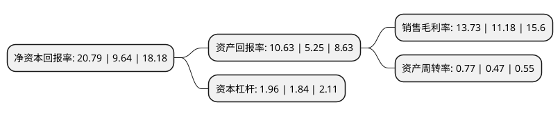

> 本页面由自动化程序生成于 2022年5月20日 01:41
> 内容可能存在错误，如有bug请提交issue至：https://github.com/Eroleice/doc-pi/issues
{.is-warning}

# 上市公司基本情况

## 基本资料

贝特瑞新材料集团股份有限公司（以下简称“贝特瑞”）成立于2000年08月07日，深圳市。于2020年07月27日在北交所北交所上市。

贝特瑞注册资本48,538.615万元，生产经营锂离子电池正极材料和负极材料;经营进出口业务，普通货运。以下是详细信息：

- 公司名称: 贝特瑞新材料集团股份有限公司
- 股票代码: 835185.BJ
- 所在地: 广东 - 深圳市
- 成立日期: 2000年08月07日
- 注册资本: 48,538.615万元
- 法定代表人: 贺雪琴
- 主营业务: 生产经营锂离子电池正极材料和负极材料;经营进出口业务，普通货运
- 公司官网: www.btrchina.com
- 公司介绍: 公司是一家以技术创新为引领，以技术领先、产品及产业链布局完善、国际与国内主流客户并重为特色，以锂离子电池负极材料和正极材料为核心产品，行业地位突出的新能源材料研发与制造商。公司秉承“创新引领”的核心价值观和经营理念，始终坚持以技术创新为引领，通过持续研发投入，取得了丰硕的技术研发成果。公司围绕锂离子电池正负极材料为核心的新能源材料领域形成了完善的产品及产业链布局。

## 股东及高管情况

上市公司第一大股东为中国宝安集团控股有限公司，持股213,201,062股，占比43.924%，为上市公司实际控制人。

截至2022年03月31日，上市公司的前十大股东中，共有6名自然人股东，2名机构股东，2个产品账户，其中5%以上大股东共有3名。上市公司前十大股东明细如下：

> 截至2022年03月31日，上市公司前十大股东信息如下：

| 股东名称 | 持股数量（股） | 持股比例 |
| --- | --- | --- |
| 中国宝安集团控股有限公司 | 213,201,062 | 43.924% |
| 中国宝安集团股份有限公司 | 118,617,561 | 24.4378% |
| 北京华鼎新动力股权投资基金(有限合伙) | 31,503,150 | 6.4903% |
| 张玮 | 9,651,951 | 1.9885% |
| 葛卫东 | 6,379,600 | 1.3143% |
| 贺雪琴 | 5,255,011 | 1.0826% |
| 唐武盛 | 5,253,000 | 1.0822% |
| 张啸 | 4,929,598 | 1.0156% |
| 中国工商银行股份有限公司-广发多因子灵活配置混合型证券投资基金 | 4,255,070 | 0.8766% |
| 曾广胜 | 2,106,321 | 0.4339% |

## 利润表分析

上市公司2021年总收入为104.91亿元，净利润为14.4亿元，实现盈利。

## 杜邦分析

> 数据列示周期：2021年 | 2020年 | 2019年
{.is-info}

上市公司的净资产收益率在近一年有所上升，上升幅度为115.66%，其变化情况分解如下：
- 上市公司的销售毛利率在近一年上升了22.81%，可能是生产效率的提升、商品原材料价格下跌或商品价格的上涨所致。
- 上市公司的资产周转率在近一年上升了63.83%，可能是源自于更快的销售回款或库存管理效果提升。
- 上市公司的财务杠杆比率在近一年上升了6.52%，可能是增加负债扩大生产规模。

