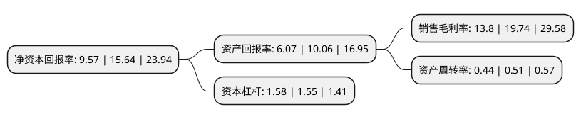

> 本页面由自动化程序生成于 2022年5月20日 01:41
> 内容可能存在错误，如有bug请提交issue至：https://github.com/Eroleice/doc-pi/issues
{.is-warning}

# 上市公司基本情况

## 基本资料

南京云创大数据科技股份有限公司（以下简称“云创数据”）成立于2011年03月18日，南京市。于2021年08月26日在北交所北交所上市。

云创数据注册资本13,237.613万元，大数据信息智能存储处理基础技术产品与应用系统的开发，运营，销售以及相关技术服务以下是详细信息：

- 公司名称: 南京云创大数据科技股份有限公司
- 股票代码: 835305.BJ
- 所在地: 江苏 - 南京市
- 成立日期: 2011年03月18日
- 注册资本: 13,237.613万元
- 法定代表人: 张真
- 主营业务: 大数据信息智能存储处理基础技术产品与应用系统的开发，运营，销售以及相关技术服务
- 公司官网: www.cstor.cn
- 公司介绍: 公司一直专注于大数据信息智能存储处理基础技术产品与应用系统的开发、运营、销售以及相关技术服务.公司是政府机构、企事业单位大数据产品与服务提供商，为客户提供完整的大数据信息智能处理整体解决方案，致力于帮助客户提升信息化水平，通过大数据信息智能处理提高客户决策水平，提升客户核心竞争力。

## 股东及高管情况

上市公司第一大股东为张真，持股60,636,000股，占比45.8058%，为上市公司实际控制人。

截至2022年03月31日，上市公司的前十大股东中，共有4名自然人股东，5名机构股东，1个产品账户，其中5%以上大股东共有3名。上市公司前十大股东明细如下：

> 截至2022年03月31日，上市公司前十大股东信息如下：

| 股东名称 | 持股数量（股） | 持股比例 |
| --- | --- | --- |
| 张真 | 60,636,000 | 45.8058% |
| 通鼎互联信息股份有限公司 | 18,157,407 | 13.7165% |
| 南京力创投资管理中心(有限合伙) | 7,731,000 | 5.8402% |
| 厦门中富鑫源投资合伙企业(有限合伙) | 4,210,933 | 3.181% |
| 宁波天堂硅谷新风股权投资合伙企业(有限合伙) | 3,354,415 | 2.534% |
| 侯春雨 | 2,934,000 | 2.2164% |
| 杭州知时股权投资合伙企业(有限合伙) | 2,029,127 | 1.5328% |
| 河南科源产业投资基金合伙企业(有限合伙) | 1,500,000 | 1.1331% |
| 白炳辉 | 978,000 | 0.7388% |
| 刘峰明 | 489,241 | 0.3696% |

## 利润表分析

上市公司2021年总收入为4.76亿元，净利润为0.65亿元，实现盈利。

## 杜邦分析

> 数据列示周期：2021年 | 2020年 | 2019年
{.is-info}

上市公司的净资产收益率在近一年有所下降，下降幅度为-38.81%，其变化情况分解如下：
- 上市公司的销售毛利率在近一年下降了-30.09%，可能是生产效率的下降、商品原材料价格上涨或商品价格的下跌所致。
- 上市公司的资产周转率在近一年下降了-13.73%，可能是源自于更慢的销售回款或库存管理效果下降。
- 上市公司的财务杠杆比率在近一年上升了1.94%，可能是增加负债扩大生产规模。

