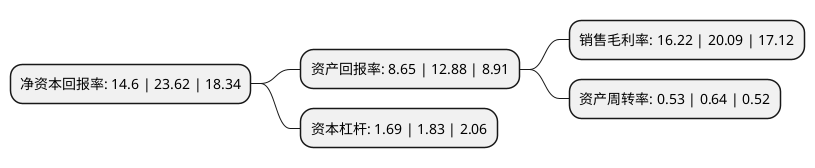

> 本页面由自动化程序生成于 2022年5月20日 01:41
> 内容可能存在错误，如有bug请提交issue至：https://github.com/Eroleice/doc-pi/issues
{.is-warning}

# 上市公司基本情况

## 基本资料

大连连城数控机器股份有限公司（以下简称“连城数控”）成立于2007年09月25日，大连市。于2020年07月27日在北交所北交所上市。

连城数控注册资本23,250.28万元，晶体硅生长及加工设备的研发，制造和销售以下是详细信息：

- 公司名称: 大连连城数控机器股份有限公司
- 股票代码: 835368.BJ
- 所在地: 辽宁 - 大连市
- 成立日期: 2007年09月25日
- 注册资本: 23,250.28万元
- 法定代表人: 李春安
- 主营业务: 晶体硅生长及加工设备的研发，制造和销售
- 公司官网: www.lintonmachine.com.cn
- 公司介绍: 公司是技术领先的光伏及半导体行业晶体硅生长和加工设备供应商，为光伏及半导体行业客户提供高性能的单晶炉、线切设备、磨床、硅片处理设备和氩气回收装置等产品。公司已经深入理解并掌握晶体硅生长设备及多线切割设备的关键技术和工艺,主要产品是晶体硅生长和加工设备，包括单晶炉、线切设备、磨床、硅片处理设备和氩气回收装置等。

## 股东及高管情况

上市公司第一大股东为海南惠智投资有限公司，持股70,536,792股，占比30.34%，为上市公司实际控制人。

截至2022年03月31日，上市公司的前十大股东中，共有6名自然人股东，2名机构股东，2个产品账户，其中5%以上大股东共有2名。上市公司前十大股东明细如下：

> 截至2022年03月31日，上市公司前十大股东信息如下：

| 股东名称 | 持股数量（股） | 持股比例 |
| --- | --- | --- |
| 海南惠智投资有限公司 | 70,536,792 | 30.34% |
| 三亚兆恒私募基金管理合伙企业(有限合伙)-如东睿达股权投资基金合伙企业(有限合伙) | 24,296,816 | 10.45% |
| 胡兰英 | 11,267,665 | 4.85% |
| 李春安 | 10,911,638 | 4.69% |
| 吴志斌 | 8,164,178 | 3.51% |
| 中国国际金融股份有限公司 | 8,050,000 | 3.46% |
| 唐武盛 | 5,560,000 | 2.39% |
| 王斌 | 4,035,451 | 1.74% |
| 王学卫 | 3,586,764 | 1.54% |
| 中国建设银行股份有限公司-易方达创新驱动灵活配置混合型证券投资基金 | 2,215,602 | 0.95% |

## 利润表分析

上市公司2021年总收入为20.4亿元，净利润为3.3亿元，实现盈利。

## 杜邦分析

> 数据列示周期：2021年 | 2020年 | 2019年
{.is-info}

上市公司的净资产收益率在近一年有所下降，下降幅度为-38.19%，其变化情况分解如下：
- 上市公司的销售毛利率在近一年下降了-19.26%，可能是生产效率的下降、商品原材料价格上涨或商品价格的下跌所致。
- 上市公司的资产周转率在近一年下降了-17.19%，可能是源自于更慢的销售回款或库存管理效果下降。
- 上市公司的财务杠杆比率在近一年下降了-7.65%，可能是减少负债降低财务费用。

