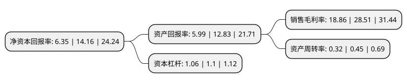

> 本页面由自动化程序生成于 2022年5月20日 01:41
> 内容可能存在错误，如有bug请提交issue至：https://github.com/Eroleice/doc-pi/issues
{.is-warning}

# 上市公司基本情况

## 基本资料

山东数字人科技股份有限公司（以下简称“数字人”）成立于2002年04月18日，济南市。于2020年12月08日在北交所北交所上市。

数字人注册资本6,636.4万元，数字医学教育类产品，生命科普类产品及交互智能一体机三大类产品以下是详细信息：

- 公司名称: 山东数字人科技股份有限公司
- 股票代码: 835670.BJ
- 所在地: 山东 - 济南市
- 成立日期: 2002年04月18日
- 注册资本: 6,636.4万元
- 法定代表人: 徐以发
- 主营业务: 数字医学教育类产品，生命科普类产品及交互智能一体机三大类产品
- 公司官网: www.digihuman.com
- 公司介绍: 公司主要从事数字医学产品的研发、生产和销售，在医学影像处理、医学教学和人体生命科普产品领域拥有多项自主开发的软、硬件产品，研发出了影像扫描三维重建及手术规划系统、数字人解剖教学系统、医学形态学数字化教学平台、显微互动教学系统、数字解剖实验室整体方案及人体生命科普产品等产品系列，客户覆盖国内200余家院校、数十家科技馆。其中“中国数字人解剖系统”已通过中国解剖学会专家委员会的鉴定，是国内唯一一个以完整的中国人解剖断层数据为重建依据的数字人解剖教学产品。

## 股东及高管情况

上市公司第一大股东为徐以发，持股27,111,273股，占比40.85%，为上市公司实际控制人。

截至2022年03月31日，上市公司的前十大股东中，共有8名自然人股东，2个产品账户，其中5%以上大股东共有1名。上市公司前十大股东明细如下：

> 截至2022年03月31日，上市公司前十大股东信息如下：

| 股东名称 | 持股数量（股） | 持股比例 |
| --- | --- | --- |
| 徐以发 | 27,111,273 | 40.85% |
| 东源华信(北京)资本管理有限公司-华信扬帆1号投资基金 | 2,712,000 | 4.09% |
| 东源华信(北京)资本管理有限公司-济南源之信股权投资基金合伙企业(有限合伙) | 2,290,000 | 3.45% |
| 李庆柱 | 1,968,000 | 2.97% |
| 李相东 | 1,396,000 | 2.1% |
| 葛新国 | 1,291,000 | 1.95% |
| 孙守华 | 946,000 | 1.43% |
| 王清平 | 912,000 | 1.37% |
| 魏昱 | 832,000 | 1.25% |
| 王爱明 | 651,550 | 0.98% |

## 利润表分析

上市公司2021年总收入为0.83亿元，净利润为0.15亿元，实现盈利。

## 杜邦分析

> 数据列示周期：2021年 | 2020年 | 2019年
{.is-info}

上市公司的净资产收益率在近一年有所下降，下降幅度为-55.16%，其变化情况分解如下：
- 上市公司的销售毛利率在近一年下降了-33.85%，可能是生产效率的下降、商品原材料价格上涨或商品价格的下跌所致。
- 上市公司的资产周转率在近一年下降了-28.89%，可能是源自于更慢的销售回款或库存管理效果下降。
- 上市公司的财务杠杆比率在近一年下降了-3.64%，可能是减少负债降低财务费用。

