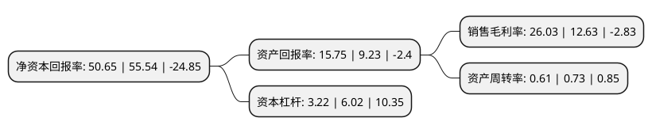

> 本页面由自动化程序生成于 2022年5月20日 01:41
> 内容可能存在错误，如有bug请提交issue至：https://github.com/Eroleice/doc-pi/issues
{.is-warning}

# 上市公司基本情况

## 基本资料

吉林碳谷碳纤维股份有限公司（以下简称“吉林碳谷”）成立于2008年12月24日，吉林市。于2021年08月31日在北交所北交所上市。

吉林碳谷注册资本31,863.636万元，碳纤维原丝及碳纤维的研发，生产和销售以下是详细信息：

- 公司名称: 吉林碳谷碳纤维股份有限公司
- 股票代码: 836077.BJ
- 所在地: 吉林 - 吉林市
- 成立日期: 2008年12月24日
- 注册资本: 31,863.636万元
- 法定代表人: 张海鸥
- 主营业务: 碳纤维原丝及碳纤维的研发，生产和销售
- 公司官网: www.jltgtxw.com
- 公司介绍: 公司位于吉林市“国家碳纤维高新技术产业化基地”，基地内有从化工源头到终端产品完备的产业链，即丙烯—丙烯腈—聚丙烯腈基碳纤维原丝—碳纤维—碳纤维下游制品。该公司主要从事聚丙烯腈基(PAN)碳纤维原丝的研发、生产和销售。公司现在主要生产有1K、3K、6K、l2K、24K、48K等聚丙烯腈基(PAN)碳纤维原丝以及预氧丝。应部分客户需要，公司采用委托加工方式为客户提供碳纤维产品。该公司主要客户是碳纤维生产商及碳纤维复合材料生产厂商和贸易商。

## 股东及高管情况

上市公司第一大股东为吉林市国兴新材料产业投资有限公司，持股159,250,000股，占比49.98%，为上市公司实际控制人。

截至2022年03月31日，上市公司的前十大股东中，共有2名自然人股东，7名机构股东，1个产品账户，其中5%以上大股东共有2名。上市公司前十大股东明细如下：

> 截至2022年03月31日，上市公司前十大股东信息如下：

| 股东名称 | 持股数量（股） | 持股比例 |
| --- | --- | --- |
| 吉林市国兴新材料产业投资有限公司 | 159,250,000 | 49.98% |
| 吉林九富城市发展投资控股(集团)有限公司 | 64,452,858 | 20.23% |
| 河北吉藁化纤有限责任公司 | 14,297,843 | 4.49% |
| 吉林市拓普纺织产业开发有限公司 | 7,237,762 | 2.27% |
| 吉林市科技投资有限公司 | 4,740,000 | 1.49% |
| 罗章华 | 4,645,201 | 1.46% |
| 北京泓石资本管理股份有限公司-北京泓石汇泉投资管理合伙企业(有限合伙) | 3,880,000 | 1.22% |
| 丁宝峰 | 2,983,000 | 0.94% |
| 华泰证券股份有限公司 | 2,968,165 | 0.93% |
| 中国银行股份有限公司-建信创新驱动混合型证券投资基金 | 1,661,989 | 0.52% |

## 利润表分析

上市公司2021年总收入为12.09亿元，净利润为3.14亿元，实现盈利。

## 杜邦分析

> 数据列示周期：2021年 | 2020年 | 2019年
{.is-info}

上市公司的净资产收益率在近一年有所下降，下降幅度为-8.8%，其变化情况分解如下：
- 上市公司的销售毛利率在近一年上升了106.1%，可能是生产效率的提升、商品原材料价格下跌或商品价格的上涨所致。
- 上市公司的资产周转率在近一年下降了-16.44%，可能是源自于更慢的销售回款或库存管理效果下降。
- 上市公司的财务杠杆比率在近一年下降了-46.51%，可能是减少负债降低财务费用。

