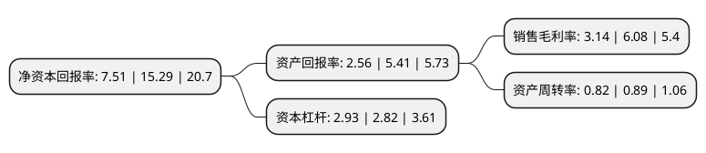

> 本页面由自动化程序生成于 2022年5月20日 01:41
> 内容可能存在错误，如有bug请提交issue至：https://github.com/Eroleice/doc-pi/issues
{.is-warning}

# 上市公司基本情况

## 基本资料

苏州旭杰建筑科技股份有限公司（以下简称“旭杰科技”）成立于2006年03月23日，苏州市。于2020年07月27日在北交所北交所上市。

旭杰科技注册资本7,375.8万元，公司主营业务为建筑装配化的研发与设计咨询，相关预制部品的生产与销售，施工安装以及工程总承包。公司目前服务和产品主要由五个业务模块构成，分别是研发与设计咨询服务，预制混凝土(PC)部品生产，装配式建筑施工，工程总承包以及预制墙板(ALC)贸易。以下是详细信息：

- 公司名称: 苏州旭杰建筑科技股份有限公司
- 股票代码: 836149.BJ
- 所在地: 江苏 - 苏州市
- 成立日期: 2006年03月23日
- 注册资本: 7,375.8万元
- 法定代表人: 丁杰
- 主营业务: 公司主营业务为建筑装配化的研发与设计咨询，相关预制部品的生产与销售，施工安装以及工程总承包公司目前服务和产品主要由五个业务模块构成，分别是研发与设计咨询服务，预制混凝土(PC)部品生产，装配式建筑施工，工程总承包以及预制墙板(ALC)贸易
- 公司官网: www.jcongroup.cn
- 公司介绍: 公司主营业务为建筑装配化的研发与设计咨询、相关预制部品的生产与销售、施工安装以及工程总承包。公司以“科技装配美好生活”为愿景，专注于推广建筑装配化的具体应用，不断研发升级相关预制部品生产和施工的技术工艺，为客户提供绿色、安全、高效的装配式建筑领域的解决方案及服务。公司目前服务和产品主要由五个业务模块构成，分别是建筑装配化研发与设计咨询服务、预制混凝土(PC)部品生产、装配式建筑施工、工程总承包以及预制墙板(ALC)贸易。

## 股东及高管情况

上市公司第一大股东为丁杰，持股15,674,069股，占比21.25%，**疑似为**上市公司实际控制人。

截至2022年03月31日，上市公司的前十大股东中，共有7名自然人股东，3名机构股东，其中5%以上大股东共有2名。上市公司前十大股东明细如下：

> 未能通过持股比例判定出上市公司实际控制人（持股30%以上）
> 可能存在通过间接持股、联合持股、协议控制等方式拥有实际控制权的主体，具体请参考上市公司定期公告！
{.is-warning}

> 截至2022年03月31日，上市公司前十大股东信息如下：

| 股东名称 | 持股数量（股） | 持股比例 |
| --- | --- | --- |
| 丁杰 | 15,674,069 | 21.25% |
| 丁强 | 15,288,920 | 20.73% |
| 何群 | 1,923,256 | 2.61% |
| 王采国 | 1,778,160 | 2.41% |
| 江苏苏博特新材料股份有限公司 | 1,748,000 | 2.37% |
| 中新智地苏州工业园区有限公司 | 1,748,000 | 2.37% |
| 张爱平 | 1,564,646 | 2.12% |
| 陈军 | 1,500,000 | 2.03% |
| 苏州赛普成长投资管理有限公司 | 1,145,700 | 1.55% |
| 陈洪 | 941,381 | 1.28% |

## 利润表分析

上市公司2021年总收入为4.72亿元，净利润为0.14亿元，实现盈利。

## 杜邦分析

> 数据列示周期：2021年 | 2020年 | 2019年
{.is-info}

上市公司的净资产收益率在近一年有所下降，下降幅度为-50.88%，其变化情况分解如下：
- 上市公司的销售毛利率在近一年下降了-48.36%，可能是生产效率的下降、商品原材料价格上涨或商品价格的下跌所致。
- 上市公司的资产周转率在近一年下降了-7.87%，可能是源自于更慢的销售回款或库存管理效果下降。
- 上市公司的财务杠杆比率在近一年上升了3.9%，可能是增加负债扩大生产规模。

