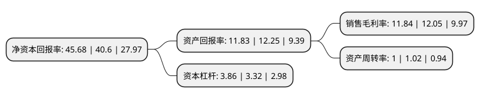

> 本页面由自动化程序生成于 2022年5月20日 01:41
> 内容可能存在错误，如有bug请提交issue至：https://github.com/Eroleice/doc-pi/issues
{.is-warning}

# 上市公司基本情况

## 基本资料

四川长虹新能源科技股份有限公司（以下简称“长虹能源”）成立于2006年10月30日，绵阳市。于2021年02月09日在北交所北交所上市。

长虹能源注册资本8,128.313万元，碱锰环保电池，锂电池的研发，生产及销售业务以下是详细信息：

- 公司名称: 四川长虹新能源科技股份有限公司
- 股票代码: 836239.BJ
- 所在地: 四川 - 绵阳市
- 成立日期: 2006年10月30日
- 注册资本: 8,128.313万元
- 法定代表人: 莫文伟
- 主营业务: 碱锰环保电池，锂电池的研发，生产及销售业务
- 公司官网: www.changhongnewenergy.com
- 公司介绍: 公司是一家集电池能源产品研发、制造、销售为一体的高新技术企业，是四川长虹电器股份有限公司的控股子公司。公司前身是四川长虹电器股份有限公司电池公司，现已成为国内目前最具规模的碱性电池企业之一。

## 股东及高管情况

上市公司第一大股东为四川长虹电子控股集团有限公司，持股49,000,000股，占比60.28%，为上市公司实际控制人。

截至2022年03月31日，上市公司的前十大股东中，共有3名自然人股东，4名机构股东，3个产品账户，其中5%以上大股东共有1名。上市公司前十大股东明细如下：

> 截至2022年03月31日，上市公司前十大股东信息如下：

| 股东名称 | 持股数量（股） | 持股比例 |
| --- | --- | --- |
| 四川长虹电子控股集团有限公司 | 49,000,000 | 60.28% |
| 郭龙 | 816,456 | 1% |
| 李勇波 | 672,610 | 0.83% |
| 中泰证券股份有限公司 | 600,465 | 0.74% |
| 安信证券股份有限公司 | 590,000 | 0.73% |
| 红塔证券股份有限公司 | 487,045 | 0.6% |
| 中国工商银行股份有限公司-汇添富创新增长一年定期开放混合型证券投资基金 | 444,249 | 0.55% |
| 中国农业银行股份有限公司-华夏北交所创新中小企业精选两年定期开放混合型发起式证券投资基金 | 418,442 | 0.51% |
| 中国工商银行股份有限公司-南方稳健成长证券投资基金 | 357,707 | 0.44% |
| 宋春岩 | 353,000 | 0.43% |

## 利润表分析

上市公司2021年总收入为30.71亿元，净利润为3.63亿元，实现盈利。

## 杜邦分析

> 数据列示周期：2021年 | 2020年 | 2019年
{.is-info}

上市公司的净资产收益率在近一年有所上升，上升幅度为12.51%，其变化情况分解如下：
- 上市公司的销售毛利率在近一年下降了-1.74%，可能是生产效率的下降、商品原材料价格上涨或商品价格的下跌所致。
- 上市公司的资产周转率在近一年下降了-1.96%，可能是源自于更慢的销售回款或库存管理效果下降。
- 上市公司的财务杠杆比率在近一年上升了16.27%，可能是增加负债扩大生产规模。

