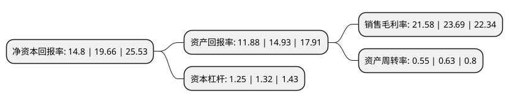

> 本页面由自动化程序生成于 2022年5月20日 01:41
> 内容可能存在错误，如有bug请提交issue至：https://github.com/Eroleice/doc-pi/issues
{.is-warning}

# 上市公司基本情况

## 基本资料

成都中寰流体控制设备股份有限公司（以下简称“中寰股份”）成立于2009年09月14日，成都市。于2021年11月15日在北交所北交所上市。

中寰股份注册资本5,177.5万元，阀门执行机构，井口安全控制系统和撬装设备的设计，研发，生产及销售以下是详细信息：

- 公司名称: 成都中寰流体控制设备股份有限公司
- 股票代码: 836260.BJ
- 所在地: 四川 - 成都市
- 成立日期: 2009年09月14日
- 注册资本: 5,177.5万元
- 法定代表人: 李瑜
- 主营业务: 阀门执行机构，井口安全控制系统和撬装设备的设计，研发，生产及销售
- 公司官网: www.zh-flow.com
- 公司介绍: 公司由成都中寰机电设备有限公司转型成立，座落于四川成都双流西南航空港开发区三期内，是一个拥有自主研发、设计和制造能力的生产型企业。公司拥有现代化的工厂和科研基地，公司设有管理、开发、销售、生产、质量安全共五个部门，拥有数控加工中心、数控车床、铣床等加工设备，主要制造气液联动执行器、井口安全阀控制系统，气动执行器，管道气驱管线截断系统、液动和电液联动执行器等。公司是集产品研发、设计、生产与销售为一体的天然气流体控制设备供应商，主要产品为气液联动执行机构及井口安全控制系统。十年来，公司在充分总结进口气液联动执行器优缺点的基础上，扬长避短，研发出更适合中国管道工程实际工况的产品，并在完全达到国外产品功能的基础上有实质性创新，如在公司研制的电子破管保护系统LBP-1000较国外产品已有革命性突破：电气电池隔爆技术、太阳能低功耗技术、低温显示技术、防阴保电流流失技术、防浪涌技术、手机短信管理技术和无线数据下载技术，测量和控制精度达到0.5%。

## 股东及高管情况

上市公司第一大股东为李瑜，持股26,800,700股，占比51.76%，为上市公司实际控制人。

截至2022年03月31日，上市公司的前十大股东中，共有9名自然人股东，1名机构股东，其中5%以上大股东共有2名。上市公司前十大股东明细如下：

> 截至2022年03月31日，上市公司前十大股东信息如下：

| 股东名称 | 持股数量（股） | 持股比例 |
| --- | --- | --- |
| 李瑜 | 26,800,700 | 51.76% |
| 陈亮 | 2,820,730 | 5.45% |
| 李青 | 1,370,000 | 2.65% |
| 李大全 | 1,011,345 | 1.95% |
| 慕超勇 | 615,497 | 1.19% |
| 刘坤 | 593,050 | 1.15% |
| 李健 | 580,000 | 1.12% |
| 上海迎水投资管理有限公司 | 510,000 | 0.99% |
| 曹晟 | 437,000 | 0.84% |
| 吴建凤 | 322,670 | 0.62% |

## 利润表分析

上市公司2021年总收入为2.14亿元，净利润为0.46亿元，实现盈利。

## 杜邦分析

> 数据列示周期：2021年 | 2020年 | 2019年
{.is-info}

上市公司的净资产收益率在近一年有所下降，下降幅度为-24.72%，其变化情况分解如下：
- 上市公司的销售毛利率在近一年下降了-8.91%，可能是生产效率的下降、商品原材料价格上涨或商品价格的下跌所致。
- 上市公司的资产周转率在近一年下降了-12.7%，可能是源自于更慢的销售回款或库存管理效果下降。
- 上市公司的财务杠杆比率在近一年下降了-5.3%，可能是减少负债降低财务费用。

