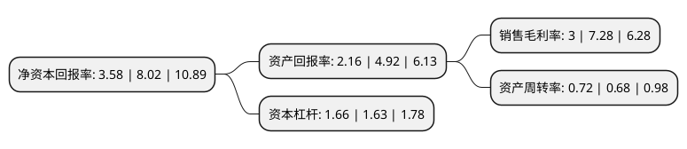

> 本页面由自动化程序生成于 2022年5月20日 01:41
> 内容可能存在错误，如有bug请提交issue至：https://github.com/Eroleice/doc-pi/issues
{.is-warning}

# 上市公司基本情况

## 基本资料

北京中航泰达环保科技股份有限公司（以下简称“中航泰达”）成立于2011年12月19日，北京市。于2020年07月27日在北交所北交所上市。

中航泰达注册资本13,996万元，运用国内领先的脱硫脱硝除尘技术为冶金，电力，化工等行业客户提供工业烟气环保工程建造，专业化运营等一体化综合治理解决方案。以下是详细信息：

- 公司名称: 北京中航泰达环保科技股份有限公司
- 股票代码: 836263.BJ
- 所在地: 北京 - 北京市
- 成立日期: 2011年12月19日
- 注册资本: 13,996万元
- 法定代表人: 刘斌
- 主营业务: 运用国内领先的脱硫脱硝除尘技术为冶金，电力，化工等行业客户提供工业烟气环保工程建造，专业化运营等一体化综合治理解决方案
- 公司官网: www.cnzhtd.com
- 公司介绍: 公司是国内领先的工业烟气治理领域综合服务商，致力于为钢铁、焦化等非电行业提供工业烟气治理全生命周期服务，具体包括工程设计、施工管理、设备成套供应、系统调试、试运行等工程总承包服务以及环保设施专业化运营服务.公司在钢铁行业烟气治理领域奠定了一定的市场地位，同时正逐步向焦化、化工等其他非电行业渗透。公司的主要业务包括环保工程建造业务及环保设施专业化运营业务两类，其中环保工程建造业务主要以环保工程总承包方式提供服务。

## 股东及高管情况

上市公司第一大股东为刘斌，持股42,481,000股，占比30.35%，为上市公司实际控制人。

截至2022年03月31日，上市公司的前十大股东中，共有6名自然人股东，4名机构股东，其中5%以上大股东共有4名。上市公司前十大股东明细如下：

> 截至2022年03月31日，上市公司前十大股东信息如下：

| 股东名称 | 持股数量（股） | 持股比例 |
| --- | --- | --- |
| 刘斌 | 42,481,000 | 30.35% |
| 陈士华 | 18,000,000 | 12.86% |
| 北京基联启迪投资管理有限公司 | 10,332,000 | 7.38% |
| 张岳 | 9,150,000 | 6.54% |
| 北京汇智聚英投资中心(有限合伙) | 6,000,000 | 4.29% |
| 烟台舒朗智能家居有限责任公司 | 5,484,000 | 3.92% |
| 北京莱福克体育文化有限公司 | 2,938,200 | 2.1% |
| 施芝月 | 1,295,851 | 0.93% |
| 施全忠 | 1,194,404 | 0.85% |
| 孙卫 | 1,117,765 | 0.8% |

## 利润表分析

上市公司2021年总收入为5.57亿元，净利润为0.16亿元，实现盈利。

## 杜邦分析

> 数据列示周期：2021年 | 2020年 | 2019年
{.is-info}

上市公司的净资产收益率在近一年有所下降，下降幅度为-55.36%，其变化情况分解如下：
- 上市公司的销售毛利率在近一年下降了-58.79%，可能是生产效率的下降、商品原材料价格上涨或商品价格的下跌所致。
- 上市公司的资产周转率在近一年上升了5.88%，可能是源自于更快的销售回款或库存管理效果提升。
- 上市公司的财务杠杆比率在近一年上升了1.84%，可能是增加负债扩大生产规模。

