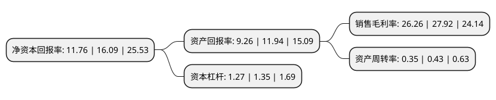

> 本页面由自动化程序生成于 2022年5月20日 01:41
> 内容可能存在错误，如有bug请提交issue至：https://github.com/Eroleice/doc-pi/issues
{.is-warning}

# 上市公司基本情况

## 基本资料

内蒙古大唐药业股份有限公司（以下简称“大唐药业”）成立于1992年08月08日，呼和浩特市。于2020年07月27日在北交所北交所上市。

大唐药业注册资本14,526.56万元，公司是一家集蒙药资源开发，特色专科药及大健康产品研发，生产，销售为一体的综合性制药企业以下是详细信息：

- 公司名称: 内蒙古大唐药业股份有限公司
- 股票代码: 836433.BJ
- 所在地: 内蒙古 - 呼和浩特市
- 成立日期: 1992年08月08日
- 注册资本: 14,526.56万元
- 法定代表人: 郝艳涛
- 主营业务: 公司是一家集蒙药资源开发，特色专科药及大健康产品研发，生产，销售为一体的综合性制药企业
- 公司官网: www.nmdt.com.cn
- 公司介绍: 公司是一家集蒙药资源开发、特色专科药和大健康产品研发、生产和销售为一体的综合性制药企业，公司药品主要分为中成药(含民族药)和化学制剂药两种类型。公司拥有药品生产许可证、GMP证书和多个药品文号，具备为市场生产和提供符合国家要求的高质量的药品的能力。公司拥有蒙医药科研基地，已建立相对完善的研发体系，配备有较强的研发团队和研发设备。公司及其全资子公司共拥有多项专利权。公司依托遍布全国的销售网络，通过经销商(配送商)等渠道将产品销售往全国各地的医院、药店、卫生站等医疗服务终端，并最终由患者进行消费和使用。

## 股东及高管情况

上市公司第一大股东为呼和浩特市仁和房地产开发有限公司，持股85,738,590股，占比59.02%，为上市公司实际控制人。

截至2022年03月31日，上市公司的前十大股东中，共有7名自然人股东，3名机构股东，其中5%以上大股东共有1名。上市公司前十大股东明细如下：

> 截至2022年03月31日，上市公司前十大股东信息如下：

| 股东名称 | 持股数量（股） | 持股比例 |
| --- | --- | --- |
| 呼和浩特市仁和房地产开发有限公司 | 85,738,590 | 59.02% |
| 郝艳涛 | 4,418,393 | 3.04% |
| 孙雅丽 | 2,431,939 | 1.67% |
| 赵琪 | 1,100,168 | 0.76% |
| 张焱 | 898,405 | 0.62% |
| 朱贺年 | 870,682 | 0.6% |
| 国信证券股份有限公司 | 847,609 | 0.58% |
| 欧阳建辉 | 790,000 | 0.54% |
| 张桂芝 | 591,430 | 0.41% |
| 兴业证券股份有限公司 | 571,725 | 0.39% |

## 利润表分析

上市公司2021年总收入为2.35亿元，净利润为0.61亿元，实现盈利。

## 杜邦分析

> 数据列示周期：2021年 | 2020年 | 2019年
{.is-info}

上市公司的净资产收益率在近一年有所下降，下降幅度为-26.91%，其变化情况分解如下：
- 上市公司的销售毛利率在近一年下降了-5.95%，可能是生产效率的下降、商品原材料价格上涨或商品价格的下跌所致。
- 上市公司的资产周转率在近一年下降了-18.6%，可能是源自于更慢的销售回款或库存管理效果下降。
- 上市公司的财务杠杆比率在近一年下降了-5.93%，可能是减少负债降低财务费用。

