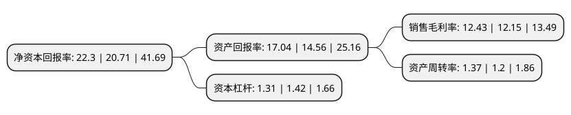

> 本页面由自动化程序生成于 2022年5月20日 01:41
> 内容可能存在错误，如有bug请提交issue至：https://github.com/Eroleice/doc-pi/issues
{.is-warning}

# 上市公司基本情况

## 基本资料

大连盖世健康食品股份有限公司（以下简称“盖世食品”）成立于2002年10月09日，大连市。于2021年01月12日在北交所北交所上市。

盖世食品注册资本8,855.408万元，食用菌，海藻及山野菜深加工产品的研发，生产和销售以下是详细信息：

- 公司名称: 大连盖世健康食品股份有限公司
- 股票代码: 836826.BJ
- 所在地: 辽宁 - 大连市
- 成立日期: 2002年10月09日
- 注册资本: 8,855.408万元
- 法定代表人: 盖泉泓
- 主营业务: 食用菌，海藻及山野菜深加工产品的研发，生产和销售
- 公司官网: www.gaishi.com
- 公司介绍: 公司通过选用国家备案基地的蘑菇和藻类以及天然无污染的野生山野菜作为生产原料，形成系列的蔬菜深加工产品。公司目前已取得欧盟、日本、美国等国内外一系列质量体系认证，产品远销日本、美国、加拿大、德国、西班牙、乌克兰、澳大利亚、新加坡、以色列、俄罗斯等十几个国家和地区。多次被评为“企业信用等级：AAA级”、“农业产业化国家重点龙头企业”。

## 股东及高管情况

上市公司第一大股东为盖泉泓，持股7,423,675股，占比8.38%，**疑似为**上市公司实际控制人。

截至2022年03月31日，上市公司的前十大股东中，共有7名自然人股东，1名机构股东，2个产品账户，其中5%以上大股东共有1名。上市公司前十大股东明细如下：

> 未能通过持股比例判定出上市公司实际控制人（持股30%以上）
> 可能存在通过间接持股、联合持股、协议控制等方式拥有实际控制权的主体，具体请参考上市公司定期公告！
{.is-warning}

> 上市公司第一大股东持股不超过10%，请检查是否存在公司控制权风险！
{.is-danger}

> 截至2022年03月31日，上市公司前十大股东信息如下：

| 股东名称 | 持股数量（股） | 持股比例 |
| --- | --- | --- |
| 盖泉泓 | 7,423,675 | 8.38% |
| 乔斌 | 2,870,000 | 3.24% |
| 中国工商银行股份有限公司-汇添富北交所创新精选两年定期开放混合型证券投资基金 | 1,433,839 | 1.62% |
| 中国工商银行股份有限公司-汇添富北交所创新精选两年定期开放混合型证券投资基金 | 758,388 | 1.62% |
| 杨子江 | 753,628 | 0.85% |
| 国元证券股份有限公司 | 683,399 | 0.77% |
| 严间桑 | 558,828 | 0.63% |
| 黄肇 | 506,875 | 0.57% |
| 张永康 | 430,000 | 0.79% |
| 荆杰 | 366,125 | 0.41% |

## 利润表分析

上市公司2021年总收入为3.44亿元，净利润为0.42亿元，实现盈利。

## 杜邦分析

> 数据列示周期：2021年 | 2020年 | 2019年
{.is-info}

上市公司的净资产收益率在近一年有所上升，上升幅度为7.68%，其变化情况分解如下：
- 上市公司的销售毛利率在近一年上升了2.3%，可能是生产效率的提升、商品原材料价格下跌或商品价格的上涨所致。
- 上市公司的资产周转率在近一年上升了14.17%，可能是源自于更快的销售回款或库存管理效果提升。
- 上市公司的财务杠杆比率在近一年下降了-7.75%，可能是减少负债降低财务费用。

