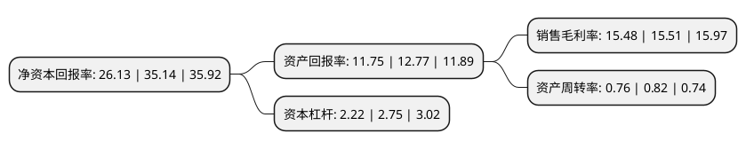

> 本页面由自动化程序生成于 2022年5月20日 01:41
> 内容可能存在错误，如有bug请提交issue至：https://github.com/Eroleice/doc-pi/issues
{.is-warning}

# 上市公司基本情况

## 基本资料

广东广咨国际工程投资顾问股份有限公司（以下简称“广咨国际”）成立于2003年01月24日，广州市。于2021年10月28日在北交所北交所上市。

广咨国际注册资本7,636.335万元，工程咨询服务;工程造价服务;招标代理服务;项目管理和工程监理服务;进口销售;进口代理服务以下是详细信息：

- 公司名称: 广东广咨国际工程投资顾问股份有限公司
- 股票代码: 836892.BJ
- 所在地: 广东 - 广州市
- 成立日期: 2003年01月24日
- 注册资本: 7,636.335万元
- 法定代表人: 蒋主浮
- 主营业务: 工程咨询服务;工程造价服务;招标代理服务;项目管理和工程监理服务;进口销售;进口代理服务
- 公司官网: www.gdiecc.com.cn
- 公司介绍: 公司由广东省国际工程咨询公司和广东省机电设备招标公司组成，是广东省第一家集项目投资机会研究、项目前期咨询及评估、项目管理、建设监理、工程造价咨询及管理与工程、设备、政府采购等招标咨询为一体的多元化服务机构。广东省国际工程咨询公司1982年10月经省政府批准成立，是国内首批成立的综合性工程咨询机构。广东省机电设备招标公司原为国家经贸委批准于1985年9月成立的以全国八大中心城市命名的区域性专职招标机构之一，是广东省推广招投标活动的开拓先行者。公司主要经营范围：提供国际工程项目投资和管理咨询，商贸市场调查研究，项目可行性研究，机电设备咨询，代理机电产品投标，行业发展和企业管理咨询(上述项目法律法规需审批的，另行报批)。房屋租赁。

## 股东及高管情况

上市公司第一大股东为广东省环保集团有限公司，持股24,500,000股，占比32.08%，为上市公司实际控制人。

截至2022年03月31日，上市公司的前十大股东中，共有6名自然人股东，4名机构股东，其中5%以上大股东共有5名。上市公司前十大股东明细如下：

> 截至2022年03月31日，上市公司前十大股东信息如下：

| 股东名称 | 持股数量（股） | 持股比例 |
| --- | --- | --- |
| 广东省环保集团有限公司 | 24,500,000 | 32.08% |
| 蒋主浮 | 7,042,866 | 9.22% |
| 广州慧咨投资发展合伙企业(有限合伙) | 5,630,240 | 7.37% |
| 广州创咨投资合伙企业(有限合伙) | 5,630,240 | 7.37% |
| 广州咨慧投资合伙企业(有限合伙) | 5,630,240 | 7.37% |
| 冯亮源 | 2,823,122 | 3.7% |
| 张朝阳 | 2,790,021 | 3.65% |
| 黄广东 | 2,759,957 | 3.61% |
| 顾伟传 | 1,023,405 | 1.34% |
| 李海燕 | 959,755 | 1.26% |

## 利润表分析

上市公司2021年总收入为4.44亿元，净利润为0.68亿元，实现盈利。

## 杜邦分析

> 数据列示周期：2021年 | 2020年 | 2019年
{.is-info}

上市公司的净资产收益率在近一年有所下降，下降幅度为-25.64%，其变化情况分解如下：
- 上市公司的销售毛利率在近一年下降了-0.19%，可能是生产效率的下降、商品原材料价格上涨或商品价格的下跌所致。
- 上市公司的资产周转率在近一年下降了-7.32%，可能是源自于更慢的销售回款或库存管理效果下降。
- 上市公司的财务杠杆比率在近一年下降了-19.27%，可能是减少负债降低财务费用。

