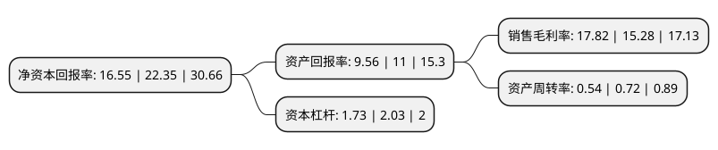

> 本页面由自动化程序生成于 2022年5月20日 01:41
> 内容可能存在错误，如有bug请提交issue至：https://github.com/Eroleice/doc-pi/issues
{.is-warning}

# 上市公司基本情况

## 基本资料

山东汉鑫科技股份有限公司（以下简称“汉鑫科技”）成立于2001年04月25日，烟台市。于2021年11月15日在北交所北交所上市。

汉鑫科技注册资本4,789.6万元，致力于为政，企客户提供信息系统解决方案，包括智能化信息系统设计和相关设备的选型采购，施工安装，开发调试，以及数字化转型，运营维护等。公司主营业务为信息系统集成，根据客户需求可分为信息安全，智慧城市，企业数字化转型服务以下是详细信息：

- 公司名称: 山东汉鑫科技股份有限公司
- 股票代码: 837092.BJ
- 所在地: 山东 - 烟台市
- 成立日期: 2001年04月25日
- 注册资本: 4,789.6万元
- 法定代表人: 刘文义
- 主营业务: 致力于为政，企客户提供信息系统解决方案，包括智能化信息系统设计和相关设备的选型采购，施工安装，开发调试，以及数字化转型，运营维护等公司主营业务为信息系统集成，根据客户需求可分为信息安全，智慧城市，企业数字化转型服务
- 公司官网: www.hiacent.cn
- 公司介绍: 公司成立于2001年，是以智慧城市项目实施、计算机信息系统集成、智能建筑系统集成为主营业务的高新技术企业。在智慧城市领域，公司实施了“建设工程安全生产与扬尘治理云数据平台”、“智慧水文水利在线监测系统”、“智慧教育--烟台高新技术开发区中学”、“智慧体育—世界休闲体育大会”、“城市节能监测与能耗管理系统”、“智慧养老—烟台市老年福利中心”等多个示范工程项目。目前，公司主营业务分为为智慧城市提供解决方案及为智能建筑提供系统集成服务两大部分。

## 股东及高管情况

上市公司第一大股东为刘文义，持股26,896,000股，占比56.16%，为上市公司实际控制人。

截至2022年03月31日，上市公司的前十大股东中，共有5名自然人股东，3名机构股东，2个产品账户，其中5%以上大股东共有3名。上市公司前十大股东明细如下：

> 截至2022年03月31日，上市公司前十大股东信息如下：

| 股东名称 | 持股数量（股） | 持股比例 |
| --- | --- | --- |
| 刘文义 | 26,896,000 | 56.16% |
| 刘苗 | 3,040,000 | 6.35% |
| 烟台凯文投资中心(有限合伙) | 2,648,000 | 5.53% |
| 刘建磊 | 1,184,000 | 2.47% |
| 江海证券有限公司 | 891,271 | 1.86% |
| 王玉敏 | 641,000 | 1.34% |
| 烟台盛裕一号股权投资基金中心(有限合伙) | 600,000 | 1.25% |
| 烟台高新国有资产管理有限公司 | 600,000 | 1.25% |
| 山东山科产研人才价值股权投资基金合伙企业(有限合伙) | 350,000 | 0.73% |
| 王晓光 | 320,000 | 0.67% |

## 利润表分析

上市公司2021年总收入为2.71亿元，净利润为0.48亿元，实现盈利。

## 杜邦分析

> 数据列示周期：2021年 | 2020年 | 2019年
{.is-info}

上市公司的净资产收益率在近一年有所下降，下降幅度为-25.95%，其变化情况分解如下：
- 上市公司的销售毛利率在近一年上升了16.62%，可能是生产效率的提升、商品原材料价格下跌或商品价格的上涨所致。
- 上市公司的资产周转率在近一年下降了-25%，可能是源自于更慢的销售回款或库存管理效果下降。
- 上市公司的财务杠杆比率在近一年下降了-14.78%，可能是减少负债降低财务费用。

