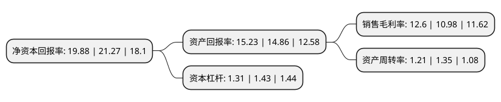

> 本页面由自动化程序生成于 2022年5月20日 01:41
> 内容可能存在错误，如有bug请提交issue至：https://github.com/Eroleice/doc-pi/issues
{.is-warning}

# 上市公司基本情况

## 基本资料

潍坊智新电子股份有限公司（以下简称“智新电子”）成立于2006年04月18日，潍坊市。于2021年06月08日在北交所北交所上市。

智新电子注册资本10,610万元，设计，生产，销售:电子元器件，电线，电线连接器，精密注塑件，冲压件;设计，生产，销售及安装:智能卫浴产品及配件;太阳能光伏电站销售电业务;货物进出口。(依法须经批准的项目，经相关部门批准后方可开展活动)以下是详细信息：

- 公司名称: 潍坊智新电子股份有限公司
- 股票代码: 837212.BJ
- 所在地: 山东 - 潍坊市
- 成立日期: 2006年04月18日
- 注册资本: 10,610万元
- 法定代表人: 赵庆福
- 主营业务: 设计，生产，销售:电子元器件，电线，电线连接器，精密注塑件，冲压件;设计，生产，销售及安装:智能卫浴产品及配件;太阳能光伏电站销售电业务;货物进出口(依法须经批准的项目，经相关部门批准后方可开展活动)
- 公司官网: www.genius-gp.com
- 公司介绍: 公司成立于2006年，主要进行各种连接器的研发、制造和销售，产品广泛应用于销费类电子、汽车电子、智能家居、新能源领域等产业。

## 股东及高管情况

上市公司第一大股东为李良伟，持股35,740,000股，占比33.69%，为上市公司实际控制人。

截至2022年05月16日，上市公司的前十大股东中，共有3名自然人股东，6名机构股东，1个产品账户，其中5%以上大股东共有2名。上市公司前十大股东明细如下：

> 截至2022年05月16日，上市公司前十大股东信息如下：

| 股东名称 | 持股数量（股） | 持股比例 |
| --- | --- | --- |
| 李良伟 | 35,740,000 | 33.69% |
| 赵庆福 | 35,740,000 | 33.69% |
| 潍坊智联企业管理中心(有限合伙) | 3,988,000 | 3.76% |
| 中泰证券股份有限公司 | 2,140,580 | 2.02% |
| 潍坊凤凰山国有资本投资运营管理有限公司 | 1,500,000 | 1.41% |
| 晨鸣(青岛)资产管理有限公司-青岛晨融柒号股权投资管理中心(有限合伙) | 915,100 | 0.86% |
| 潍坊恒新资本管理有限公司 | 780,000 | 0.74% |
| 招商银行股份有限公司-嘉实北交所精选两年定期开放混合型证券投资基金 | 621,794 | 0.59% |
| 国元证券股份有限公司 | 500,000 | 0.47% |
| 鄢军 | 500,000 | 0.47% |

## 利润表分析

上市公司2021年总收入为4.52亿元，净利润为0.56亿元，实现盈利。

## 杜邦分析

> 数据列示周期：2021年 | 2020年 | 2019年
{.is-info}

上市公司的净资产收益率在近一年有所下降，下降幅度为-6.54%，其变化情况分解如下：
- 上市公司的销售毛利率在近一年上升了14.75%，可能是生产效率的提升、商品原材料价格下跌或商品价格的上涨所致。
- 上市公司的资产周转率在近一年下降了-10.37%，可能是源自于更慢的销售回款或库存管理效果下降。
- 上市公司的财务杠杆比率在近一年下降了-8.39%，可能是减少负债降低财务费用。

