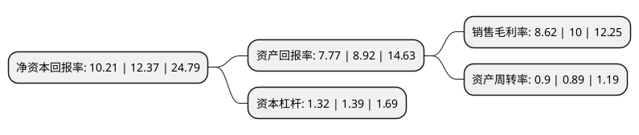

> 本页面由自动化程序生成于 2022年5月20日 01:41
> 内容可能存在错误，如有bug请提交issue至：https://github.com/Eroleice/doc-pi/issues
{.is-warning}

# 上市公司基本情况

## 基本资料

青岛建邦汽车科技股份有限公司（以下简称“建邦科技”）成立于2004年01月06日，青岛市。于2020年07月27日在北交所北交所上市。

建邦科技注册资本6,237.3万元，汽车后市场非易损零部件的开发，设计与销售以下是详细信息：

- 公司名称: 青岛建邦汽车科技股份有限公司
- 股票代码: 837242.BJ
- 所在地: 山东 - 青岛市
- 成立日期: 2004年01月06日
- 注册资本: 6,237.3万元
- 法定代表人: 钟永铎
- 主营业务: 汽车后市场非易损零部件的开发，设计与销售
- 公司官网: www.qi-auto.com
- 公司介绍: 公司致力于汽车后市场非易损零部件的开发、设计与销售，同时为客户提供整套完善的供应链管理服务。公司采取柔性化的市场需求导向型模式，将重点放在市场调研、工程设计、模具开发、产品验证上，生产环节委托外部厂商进行，公司主要负责对其关键技术把控及指导，并进行质量管理。公司凭借在物流、商流、信息流等方面的整合能力，为客户提供综合解决方案。公司的主要产品包括制动系统、传动系统、电子电气系统、转向系统、发动系统和汽车其他系统。

## 股东及高管情况

上市公司第一大股东为钟永铎，持股32,094,700股，占比51.46%，为上市公司实际控制人。

截至2022年03月31日，上市公司的前十大股东中，共有3名自然人股东，3名机构股东，4个产品账户，其中5%以上大股东共有2名。上市公司前十大股东明细如下：

> 截至2022年03月31日，上市公司前十大股东信息如下：

| 股东名称 | 持股数量（股） | 持股比例 |
| --- | --- | --- |
| 钟永铎 | 32,094,700 | 51.46% |
| 青岛星盟投资中心(有限合伙) | 4,500,000 | 7.21% |
| 深圳市安鹏股权投资基金企业(有限合伙) | 2,702,187 | 4.33% |
| 上海宽远资产管理有限公司-宽远沪港深精选私募证券投资基金 | 1,288,045 | 2.07% |
| 张立祥 | 1,270,000 | 2.04% |
| 严琳 | 939,808 | 1.51% |
| 青岛金胶州资产经营有限公司 | 937,500 | 1.5% |
| 宁波致信投资管理合伙企业(有限合伙)-晋江致信弘远股权投资合伙企业(有限合伙) | 600,000 | 0.96% |
| 上海宁泉资产管理有限公司-宁泉致远55号私募证券投资基金 | 581,893 | 0.93% |
| 上海宁泉资产管理有限公司-宁泉致远8号私募证券投资基金 | 549,209 | 0.88% |

## 利润表分析

上市公司2021年总收入为4.81亿元，净利润为0.41亿元，实现盈利。

## 杜邦分析

> 数据列示周期：2021年 | 2020年 | 2019年
{.is-info}

上市公司的净资产收益率在近一年有所下降，下降幅度为-17.46%，其变化情况分解如下：
- 上市公司的销售毛利率在近一年下降了-13.8%，可能是生产效率的下降、商品原材料价格上涨或商品价格的下跌所致。
- 上市公司的资产周转率在近一年上升了1.12%，可能是源自于更快的销售回款或库存管理效果提升。
- 上市公司的财务杠杆比率在近一年下降了-5.04%，可能是减少负债降低财务费用。

