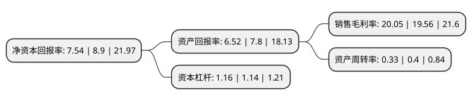

> 本页面由自动化程序生成于 2022年5月20日 01:41
> 内容可能存在错误，如有bug请提交issue至：https://github.com/Eroleice/doc-pi/issues
{.is-warning}

# 上市公司基本情况

## 基本资料

北京三元基因药业股份有限公司（以下简称“三元基因”）成立于1992年09月24日，北京市。于2021年01月08日在北交所北交所上市。

三元基因注册资本12,181万元，公司主要从事生物医药的研究，开发，生产和销售，主要产品有:注射用人干扰素α1b，人干扰素α1b注射液，人干扰素α1b滴眼液，重组人干扰素α1b喷雾剂等。以下是详细信息：

- 公司名称: 北京三元基因药业股份有限公司
- 股票代码: 837344.BJ
- 所在地: 北京 - 北京市
- 成立日期: 1992年09月24日
- 注册资本: 12,181万元
- 法定代表人: 程永庆
- 主营业务: 公司主要从事生物医药的研究，开发，生产和销售，主要产品有:注射用人干扰素α1b，人干扰素α1b注射液，人干扰素α1b滴眼液，重组人干扰素α1b喷雾剂等
- 公司官网: www.triprime.com
- 公司介绍: 公司主要从事现代生物医药产品的研究、开发、生产和销售，是中国基因工程药物基础研究和临床应用开发领域的领先企业。公司产品主要包括多种剂型和规格的重组人干扰素α1b，以该产品为首的“基因工程人α型干扰素系列产品的研制生产和应用”项目曾荣获国家科学技术进步奖一等奖。其中，注射用重组人干扰素α1b、重组人干扰素α1b注射液已列入《国家基本医疗保险、工伤保险和生育保险药品目录》和《国家基本药物目录(2018年版)》。

## 股东及高管情况

上市公司第一大股东为北京东南医药投资控股有限公司，持股46,907,925股，占比38.5091%，为上市公司实际控制人。

截至2022年03月31日，上市公司的前十大股东中，共有7名自然人股东，3名机构股东，其中5%以上大股东共有4名。上市公司前十大股东明细如下：

> 截至2022年03月31日，上市公司前十大股东信息如下：

| 股东名称 | 持股数量（股） | 持股比例 |
| --- | --- | --- |
| 北京东南医药投资控股有限公司 | 46,907,925 | 38.5091% |
| 浙江圣达科技发展有限公司 | 17,199,373 | 14.1198% |
| 张红斌 | 9,276,702 | 7.6157% |
| 程永庆 | 6,278,550 | 5.1544% |
| 北京元进医药投资管理中心(普通合伙) | 2,740,000 | 2.2494% |
| 于传卫 | 2,576,400 | 2.1151% |
| 晏征宇 | 1,858,100 | 1.5254% |
| 胡光渭 | 1,134,000 | 0.931% |
| 刘金毅 | 1,017,600 | 0.8354% |
| 杨大军 | 1,012,300 | 0.831% |

## 利润表分析

上市公司2021年总收入为2.01亿元，净利润为0.4亿元，实现盈利。

## 杜邦分析

> 数据列示周期：2021年 | 2020年 | 2019年
{.is-info}

上市公司的净资产收益率在近一年有所下降，下降幅度为-15.28%，其变化情况分解如下：
- 上市公司的销售毛利率在近一年上升了2.51%，可能是生产效率的提升、商品原材料价格下跌或商品价格的上涨所致。
- 上市公司的资产周转率在近一年下降了-17.5%，可能是源自于更慢的销售回款或库存管理效果下降。
- 上市公司的财务杠杆比率在近一年上升了1.75%，可能是增加负债扩大生产规模。

