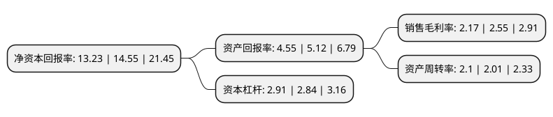

> 本页面由自动化程序生成于 2022年5月20日 01:41
> 内容可能存在错误，如有bug请提交issue至：https://github.com/Eroleice/doc-pi/issues
{.is-warning}

# 上市公司基本情况

## 基本资料

湖南德众汽车销售服务股份有限公司（以下简称“德众汽车”）成立于2010年02月25日，怀化市。于2020年11月27日在北交所北交所上市。

德众汽车注册资本17,883.968万元，汽车销售，汽车维修保养，汽车配件销售及汽车代办上牌上户年检服务，汽车按揭代办服务等以下是详细信息：

- 公司名称: 湖南德众汽车销售服务股份有限公司
- 股票代码: 838030.BJ
- 所在地: 湖南 - 怀化市
- 成立日期: 2010年02月25日
- 注册资本: 17,883.968万元
- 法定代表人: 段坤良
- 主营业务: 汽车销售，汽车维修保养，汽车配件销售及汽车代办上牌上户年检服务，汽车按揭代办服务等
- 公司官网: www.hndzgf.com
- 公司介绍: 公司成立于2010年2月25日，总部位于湖南省怀化市，是一家以汽车整车销售为主、集多品牌4S店与多项汽车后市场服务为一体的专业汽车销售服务企业。公司的主营业务包括汽车整车销售、汽车售后维保服务及汽车增值服务。公司经销品牌范围涵盖中高端共十多个乘用车品牌，多元化的品牌组合符合中西部地区的市场状况，使公司能够抓住中西部地区消费升级带来的发展机遇，实现业务规模和盈利水平的快速发展。

## 股东及高管情况

上市公司第一大股东为段坤良，持股73,049,157股，占比40.85%，为上市公司实际控制人。

截至2022年03月31日，上市公司的前十大股东中，共有9名自然人股东，1名机构股东，其中5%以上大股东共有4名。上市公司前十大股东明细如下：

> 截至2022年03月31日，上市公司前十大股东信息如下：

| 股东名称 | 持股数量（股） | 持股比例 |
| --- | --- | --- |
| 段坤良 | 73,049,157 | 40.85% |
| 王卫林 | 19,218,010 | 10.75% |
| 李延东 | 17,418,408 | 9.74% |
| 高万平 | 9,290,000 | 5.19% |
| 怀化市正宇物资有限公司 | 5,786,000 | 3.24% |
| 易斈播 | 4,022,619 | 2.25% |
| 杨晓刚 | 3,835,463 | 2.14% |
| 郑忠光 | 3,590,451 | 2.01% |
| 张辉 | 3,570,406 | 2% |
| 骆自强 | 2,268,537 | 1.27% |

## 利润表分析

上市公司2021年总收入为27.44亿元，净利润为0.59亿元，实现盈利。

## 杜邦分析

> 数据列示周期：2021年 | 2020年 | 2019年
{.is-info}

上市公司的净资产收益率在近一年有所下降，下降幅度为-9.07%，其变化情况分解如下：
- 上市公司的销售毛利率在近一年下降了-14.9%，可能是生产效率的下降、商品原材料价格上涨或商品价格的下跌所致。
- 上市公司的资产周转率在近一年上升了4.48%，可能是源自于更快的销售回款或库存管理效果提升。
- 上市公司的财务杠杆比率在近一年上升了2.46%，可能是增加负债扩大生产规模。

