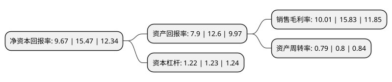

> 本页面由自动化程序生成于 2022年5月20日 01:41
> 内容可能存在错误，如有bug请提交issue至：https://github.com/Eroleice/doc-pi/issues
{.is-warning}

# 上市公司基本情况

## 基本资料

河北方大包装股份有限公司（以下简称“方大股份”）成立于2003年05月22日，石家庄市。于2020年07月27日在北交所北交所上市。

方大股份注册资本12,600万元，物流快递包装的生产，销售以及胶黏材料研发以下是详细信息：

- 公司名称: 河北方大包装股份有限公司
- 股票代码: 838163.BJ
- 所在地: 河北 - 石家庄市
- 成立日期: 2003年05月22日
- 注册资本: 12,600万元
- 法定代表人: 杨志
- 主营业务: 物流快递包装的生产，销售以及胶黏材料研发
- 公司官网: www.hbfd.cn
- 公司介绍: 公司主营业务为物流快递包装的生产、销售以及胶黏材料研发，是一家及研发、生产与销售为一体的高新技术企业，产品包括背胶袋、防水袋、气泡袋和可变信息物流标。公司拥有专业的研发团队、核心设备及自主研发的技术配方，主要环节的原材料均由公司内部自行生产，实现了垂直整合。公司凭借独有的核心技术优势、研发实力以及亚太地区主要的背胶袋供应商的行业地位，为全球物流、快递、邮政等行业提供包装产品设计和制造。公司是亚太地区主要的背胶袋产品供应商之一，且是中国早期自主研制物流快递行业配套塑料包装、胶黏制品的公司之一。

## 股东及高管情况

上市公司第一大股东为杨志，持股81,651,000股，占比64.8024%，为上市公司实际控制人。

截至2022年03月31日，上市公司的前十大股东中，共有6名自然人股东，3名机构股东，1个产品账户，其中5%以上大股东共有1名。上市公司前十大股东明细如下：

> 截至2022年03月31日，上市公司前十大股东信息如下：

| 股东名称 | 持股数量（股） | 持股比例 |
| --- | --- | --- |
| 杨志 | 81,651,000 | 64.8024% |
| 贾鸿连 | 5,179,000 | 4.1103% |
| 黄超 | 4,507,008 | 3.577% |
| 石家庄汇同企业管理中心(有限合伙) | 4,500,000 | 3.5714% |
| 蒋跃敏 | 1,886,300 | 1.4971% |
| 宁波梅山保税港区盛润隆源股权投资合伙企业(有限合伙) | 1,680,000 | 1.3333% |
| 徐红兵 | 1,350,000 | 1.0714% |
| 江海证券有限公司 | 1,042,430 | 0.8273% |
| 谢信辉 | 837,600 | 0.6648% |
| 上海惠畅投资管理合伙企业(有限合伙)-嘉兴玉冠弘仁股权投资基金合伙企业(有限合伙) | 628,849 | 0.4991% |

## 利润表分析

上市公司2021年总收入为3.62亿元，净利润为0.36亿元，实现盈利。

## 杜邦分析

> 数据列示周期：2021年 | 2020年 | 2019年
{.is-info}

上市公司的净资产收益率在近一年有所下降，下降幅度为-37.49%，其变化情况分解如下：
- 上市公司的销售毛利率在近一年下降了-36.77%，可能是生产效率的下降、商品原材料价格上涨或商品价格的下跌所致。
- 上市公司的资产周转率在近一年下降了-1.25%，可能是源自于更慢的销售回款或库存管理效果下降。
- 上市公司的财务杠杆比率在近一年下降了-0.81%，可能是减少负债降低财务费用。

