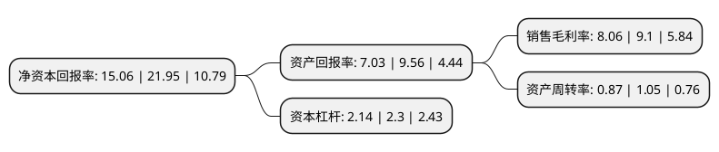

> 本页面由自动化程序生成于 2022年5月20日 01:41
> 内容可能存在错误，如有bug请提交issue至：https://github.com/Eroleice/doc-pi/issues
{.is-warning}

# 上市公司基本情况

## 基本资料

广脉科技股份有限公司（以下简称“广脉科技”）成立于2012年03月22日，杭州市。于2021年11月03日在北交所北交所上市。

广脉科技注册资本8,300万元，信息通信系统集成，ICT行业应用，资产运营服务，数字内容服务等以下是详细信息：

- 公司名称: 广脉科技股份有限公司
- 股票代码: 838924.BJ
- 所在地: 浙江 - 杭州市
- 成立日期: 2012年03月22日
- 注册资本: 8,300万元
- 法定代表人: 赵国民
- 主营业务: 信息通信系统集成，ICT行业应用，资产运营服务，数字内容服务等
- 公司官网: www.gcomtechnology.com
- 公司介绍: 公司是一家无线通信网络优化领域集研发、销售及相关服务于一体的高新技术企业，致力于提供无线通信网络优化整体解决方案及一站式服务，包括设计、施工、调试、优化及后续的技术服务等。公司的主要客户为公网通信及专网通信的营运商及建设方，包括中国移动、联通、电信等大型电信运营公司，中国铁塔等通讯网络的建设方，以及铁路、地铁、广电专网通信网络的建设方。公司承接公网无线通信系统集成业务、铁路GSM-R无线网络规划设计及网络优化服务、广电及公安专网无线通信系统集成等业务。公司主要产品包括室分/WLAN、管线传输、宽带、设备安装等无线公网通信系统集成服务、铁路、广电、公安等专网无线通信系统集成服务、“智慧城市”系统集成服务、公网及专网定制化产品供应等。

## 股东及高管情况

上市公司第一大股东为赵国民，持股33,045,591股，占比39.814%，为上市公司实际控制人。

截至2022年04月27日，上市公司的前十大股东中，共有7名自然人股东，3名机构股东，其中5%以上大股东共有2名。上市公司前十大股东明细如下：

> 截至2022年04月27日，上市公司前十大股东信息如下：

| 股东名称 | 持股数量（股） | 持股比例 |
| --- | --- | --- |
| 赵国民 | 33,045,591 | 39.814% |
| 赵淑飞 | 5,439,319 | 6.5534% |
| 浙江磐星投资有限公司 | 3,095,205 | 3.7292% |
| 李之璁 | 2,600,000 | 3.1325% |
| 王欢 | 2,022,631 | 2.4369% |
| 沈颖 | 1,912,081 | 2.3037% |
| 沈建中 | 1,774,281 | 2.1377% |
| 诸暨华睿新锐投资合伙企业(有限合伙) | 1,319,486 | 1.5897% |
| 严晓飞 | 1,281,618 | 1.5441% |
| 南京信瑞合企业管理有限公司 | 1,254,782 | 1.5118% |

## 利润表分析

上市公司2021年总收入为3.77亿元，净利润为0.3亿元，实现盈利。

## 杜邦分析

> 数据列示周期：2021年 | 2020年 | 2019年
{.is-info}

上市公司的净资产收益率在近一年有所下降，下降幅度为-31.39%，其变化情况分解如下：
- 上市公司的销售毛利率在近一年下降了-11.43%，可能是生产效率的下降、商品原材料价格上涨或商品价格的下跌所致。
- 上市公司的资产周转率在近一年下降了-17.14%，可能是源自于更慢的销售回款或库存管理效果下降。
- 上市公司的财务杠杆比率在近一年下降了-6.96%，可能是减少负债降低财务费用。

