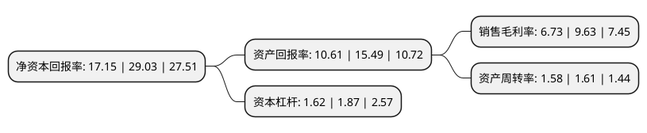

> 本页面由自动化程序生成于 2022年5月20日 01:41
> 内容可能存在错误，如有bug请提交issue至：https://github.com/Eroleice/doc-pi/issues
{.is-warning}

# 上市公司基本情况

## 基本资料

同享(苏州)电子材料科技股份有限公司（以下简称“同享科技”）成立于2010年11月10日，苏州市。于2020年07月27日在北交所北交所上市。

同享科技注册资本10,332万元，光伏焊带以下是详细信息：

- 公司名称: 同享(苏州)电子材料科技股份有限公司
- 股票代码: 839167.BJ
- 所在地: 江苏 - 苏州市
- 成立日期: 2010年11月10日
- 注册资本: 10,332万元
- 法定代表人: 陆利斌
- 主营业务: 光伏焊带
- 公司官网: www.tonyshare.com
- 公司介绍: 公司专注于高性能光伏焊带的研发、生产、销售，主要产品包括互连焊带和汇流焊带。公司拥有多年光伏产业辅料从业经历，主要为大型光伏行业电池组件厂商提供焊带原料。公司借助各种渠道与行业内多家公司建立联系，成为合格供应商，并积极参加境内外展会吸引潜在客户，进而取得订单。在综合考虑原材料价格及加工制造成本、损耗率及合理利润率基础上制定产品价格。倚靠自主研发、自主生产作为支撑，公司通过主动营销的方式向客户提供产品从而获取利润及现金流。

## 股东及高管情况

上市公司第一大股东为苏州同友投资管理合伙企业(有限合伙)，持股54,630,000股，占比52.8746%，为上市公司实际控制人。

截至2022年03月31日，上市公司的前十大股东中，共有3名自然人股东，4名机构股东，3个产品账户，其中5%以上大股东共有2名。上市公司前十大股东明细如下：

> 截至2022年03月31日，上市公司前十大股东信息如下：

| 股东名称 | 持股数量（股） | 持股比例 |
| --- | --- | --- |
| 苏州同友投资管理合伙企业(有限合伙) | 54,630,000 | 52.8746% |
| 同亨香港有限公司 | 14,774,600 | 14.2998% |
| 陆利斌 | 4,320,000 | 4.1812% |
| 上海宝源胜知投资管理有限公司 | 2,941,338 | 2.8468% |
| 深圳鑫然投资管理有限公司-鑫然1号证券投资基金 | 1,208,675 | 1.1698% |
| 安信证券股份有限公司 | 1,125,000 | 1.0889% |
| 中国工商银行股份有限公司-汇添富北交所创新精选两年定期开放混合型证券投资基金 | 1,041,662 | 1.0082% |
| 招商银行股份有限公司-嘉实北交所精选两年定期开放混合型证券投资基金 | 947,291 | 0.9169% |
| 杨伟华 | 836,842 | 0.81% |
| 黄光伟 | 752,600 | 0.7284% |

## 利润表分析

上市公司2021年总收入为8.02亿元，净利润为0.53亿元，实现盈利。

## 杜邦分析

> 数据列示周期：2021年 | 2020年 | 2019年
{.is-info}

上市公司的净资产收益率在近一年有所下降，下降幅度为-40.92%，其变化情况分解如下：
- 上市公司的销售毛利率在近一年下降了-30.11%，可能是生产效率的下降、商品原材料价格上涨或商品价格的下跌所致。
- 上市公司的资产周转率在近一年下降了-1.86%，可能是源自于更慢的销售回款或库存管理效果下降。
- 上市公司的财务杠杆比率在近一年下降了-13.37%，可能是减少负债降低财务费用。

