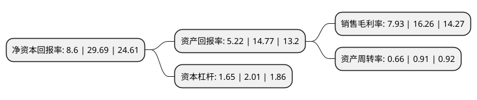

> 本页面由自动化程序生成于 2022年5月20日 01:41
> 内容可能存在错误，如有bug请提交issue至：https://github.com/Eroleice/doc-pi/issues
{.is-warning}

# 上市公司基本情况

## 基本资料

湖北华阳汽车变速系统股份有限公司（以下简称“华阳变速”）成立于1994年06月30日，十堰市。于2021年07月20日在北交所北交所上市。

华阳变速注册资本13,499.044万元，汽车变速系统零部件的研发，生产和销售以下是详细信息：

- 公司名称: 湖北华阳汽车变速系统股份有限公司
- 股票代码: 839946.BJ
- 所在地: 湖北 - 十堰市
- 成立日期: 1994年06月30日
- 注册资本: 13,499.044万元
- 法定代表人: 陈伦宏
- 主营业务: 汽车变速系统零部件的研发，生产和销售
- 公司官网: www.hybiansu.com
- 公司介绍: 公司成立于1994年，公司主营业务为汽车变速系统产品的研发与生产，主要从事汽车换挡机构的设计、研发与制造，并致力于汽车零部件轻量化。是国内第一家也是目前国内最大的专业化汽车拨叉、汽车换挡机构制造商。公司产品以专业化的汽车换档机构系统总成为主，包括汽车拨叉、叉轴、上盖、顶盖、变速箱壳体、离壳等汽车变速系统相关零部件，制动器，发动机支架、平衡悬架及其他精密铸钢类零件、镁铝压铸类零件。

## 股东及高管情况

上市公司第一大股东为陈守全，持股19,760,438股，占比14.6384%，**疑似为**上市公司实际控制人。

截至2022年03月31日，上市公司的前十大股东中，共有9名自然人股东，1名机构股东，其中5%以上大股东共有2名。上市公司前十大股东明细如下：

> 未能通过持股比例判定出上市公司实际控制人（持股30%以上）
> 可能存在通过间接持股、联合持股、协议控制等方式拥有实际控制权的主体，具体请参考上市公司定期公告！
{.is-warning}

> 截至2022年03月31日，上市公司前十大股东信息如下：

| 股东名称 | 持股数量（股） | 持股比例 |
| --- | --- | --- |
| 陈守全 | 19,760,438 | 14.6384% |
| 湖北华阳投资集团有限公司 | 11,158,000 | 8.2658% |
| 陈伦宏 | 5,870,318 | 4.3487% |
| 侯克斌 | 5,700,840 | 4.2231% |
| 李文清 | 5,570,839 | 4.1268% |
| 罗根生 | 4,459,736 | 3.3037% |
| 曹虎 | 4,242,736 | 3.143% |
| 纪静 | 3,845,676 | 2.8489% |
| 宋立平 | 3,810,236 | 2.8226% |
| 陈守芬 | 3,809,735 | 2.8222% |

## 利润表分析

上市公司2021年总收入为2.78亿元，净利润为0.22亿元，实现盈利。

## 杜邦分析

> 数据列示周期：2021年 | 2020年 | 2019年
{.is-info}

上市公司的净资产收益率在近一年有所下降，下降幅度为-71.03%，其变化情况分解如下：
- 上市公司的销售毛利率在近一年下降了-51.23%，可能是生产效率的下降、商品原材料价格上涨或商品价格的下跌所致。
- 上市公司的资产周转率在近一年下降了-27.47%，可能是源自于更慢的销售回款或库存管理效果下降。
- 上市公司的财务杠杆比率在近一年下降了-17.91%，可能是减少负债降低财务费用。

