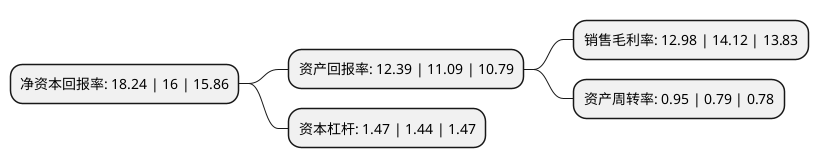

> 本页面由自动化程序生成于 2022年5月20日 01:41
> 内容可能存在错误，如有bug请提交issue至：https://github.com/Eroleice/doc-pi/issues
{.is-warning}

# 上市公司基本情况

## 基本资料

南京沪江复合材料股份有限公司（以下简称“沪江材料”）成立于1995年07月31日，南京市。于2022年01月18日在北交所北交所上市。

沪江材料注册资本3,223.515万元，复合材料，塑料包装制品的生产及销售以下是详细信息：

- 公司名称: 南京沪江复合材料股份有限公司
- 股票代码: 870204.BJ
- 所在地: 江苏 - 南京市
- 成立日期: 1995年07月31日
- 注册资本: 3,223.515万元
- 法定代表人: 章育骏
- 主营业务: 复合材料，塑料包装制品的生产及销售
- 公司官网: www.njhjgs.com
- 公司介绍: 公司主要从事复合材料、塑料包装制品的研发、生产和销售；产品包括：工业用铝塑复合重包装袋(膜)、各类食品级软包装袋(膜)、250L以上各类液体袋、太阳能光伏背板用PE膜、建筑和工业用保温材料。公司努力打造完善的产品结构、全面整合产品规格，根据客户的实际需求生产定制化的产品，满足客户在包装产品大小、承重能力、阻隔性、异形等方面的要求。

## 股东及高管情况

上市公司第一大股东为秦文萍，持股8,997,000股，占比27.91%，**疑似为**上市公司实际控制人。

截至2022年03月31日，上市公司的前十大股东中，共有4名自然人股东，4名机构股东，2个产品账户，其中5%以上大股东共有2名。上市公司前十大股东明细如下：

> 未能通过持股比例判定出上市公司实际控制人（持股30%以上）
> 可能存在通过间接持股、联合持股、协议控制等方式拥有实际控制权的主体，具体请参考上市公司定期公告！
{.is-warning}

> 截至2022年03月31日，上市公司前十大股东信息如下：

| 股东名称 | 持股数量（股） | 持股比例 |
| --- | --- | --- |
| 秦文萍 | 8,997,000 | 27.91% |
| 章育骏 | 7,994,100 | 24.8% |
| 章澄 | 1,400,000 | 4.34% |
| 章洁 | 1,200,000 | 3.72% |
| 南京沪宏企业管理咨询中心(有限合伙) | 800,000 | 2.48% |
| 苏州盛璟创新创业投资企业(有限合伙) | 685,300 | 2.13% |
| 南京沪恒企业管理咨询中心(有限合伙) | 600,000 | 1.86% |
| 国元证券股份有限公司 | 572,990 | 1.78% |
| 中国工商银行股份有限公司-汇添富北交所创新精选两年定期开放混合型证券投资基金 | 394,206 | 1.22% |
| 山东一鼎基金管理有限公司-一鼎新精选1号私募证券投资基金 | 326,451 | 1.01% |

## 利润表分析

上市公司2021年总收入为3.28亿元，净利润为0.42亿元，实现盈利。

## 杜邦分析

> 数据列示周期：2021年 | 2020年 | 2019年
{.is-info}

上市公司的净资产收益率在近一年有所上升，上升幅度为14%，其变化情况分解如下：
- 上市公司的销售毛利率在近一年下降了-8.07%，可能是生产效率的下降、商品原材料价格上涨或商品价格的下跌所致。
- 上市公司的资产周转率在近一年上升了20.25%，可能是源自于更快的销售回款或库存管理效果提升。
- 上市公司的财务杠杆比率在近一年上升了2.08%，可能是增加负债扩大生产规模。

