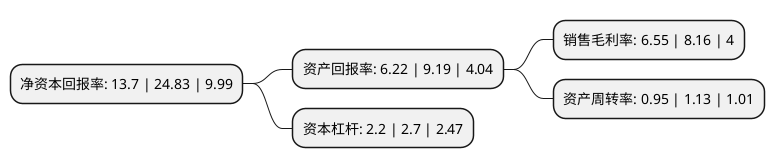

> 本页面由自动化程序生成于 2022年5月20日 01:41
> 内容可能存在错误，如有bug请提交issue至：https://github.com/Eroleice/doc-pi/issues
{.is-warning}

# 上市公司基本情况

## 基本资料

南通大地电气股份有限公司（以下简称“大地电气”）成立于2002年11月08日，南通市。于2021年11月15日在北交所北交所上市。

大地电气注册资本9,447.6万元，公司主要提供商用汽车，乘用汽车，工程机械和新能源汽车等整车线束配套解决方案，以及发动机的低压电线束等汽车零部件的研发，生产和销售。以下是详细信息：

- 公司名称: 南通大地电气股份有限公司
- 股票代码: 870436.BJ
- 所在地: 江苏 - 南通市
- 成立日期: 2002年11月08日
- 注册资本: 9,447.6万元
- 法定代表人: 蒋明泉
- 主营业务: 公司主要提供商用汽车，乘用汽车，工程机械和新能源汽车等整车线束配套解决方案，以及发动机的低压电线束等汽车零部件的研发，生产和销售
- 公司官网: www.ntgec.com
- 公司介绍: 公司主要提供商用汽车、乘用汽车、工程机械和新能源汽车等整车线束配套解决方案，以及发动机的低压电线束等汽车零部件的研发、生产和销售。产品主要应用在整车组装制造领域，其中汽车线束是汽车电路的网络主体，是为汽车各种电器具提供电能和电信号的电子控制系统。公司属于汽车制造业，主要提供商用车、乘用车、工程机械和新能源汽车等整车线束配套解决方案，以及发动机的低压电线束等汽车零部件的研发、生产和销售，主要产品包括重卡全车线束、轻卡全车线束、乘用车线束、SUV和PK全车线束、工程机械线束、农林机械线束、发动机专用线束、新能源线束、新能源充电枪、充电宝等产品。

## 股东及高管情况

上市公司第一大股东为南通聚源投资管理有限公司，持股37,306,000股，占比39.49%，为上市公司实际控制人。

截至2022年03月31日，上市公司的前十大股东中，共有3名自然人股东，7名机构股东，其中5%以上大股东共有3名。上市公司前十大股东明细如下：

> 截至2022年03月31日，上市公司前十大股东信息如下：

| 股东名称 | 持股数量（股） | 持股比例 |
| --- | --- | --- |
| 南通聚源投资管理有限公司 | 37,306,000 | 39.49% |
| 昆山宏致电子有限公司 | 18,240,000 | 19.31% |
| 南通康达投资咨询中心(有限合伙) | 8,849,000 | 9.37% |
| 南通同达投资咨询中心(有限合伙) | 2,000,000 | 2.12% |
| 吉林武 | 1,578,100 | 1.67% |
| 安庆泰达信产业投资有限公司 | 1,500,000 | 1.59% |
| 王建华 | 943,200 | 1% |
| 北京中兴通诚数据技术有限公司 | 600,000 | 0.64% |
| 北京达麟投资管理有限公司-青岛盈芯创业投资合伙企业(有限合伙) | 500,000 | 0.53% |
| 朱军 | 400,013 | 0.42% |

## 利润表分析

上市公司2021年总收入为7.95亿元，净利润为0.52亿元，实现盈利。

## 杜邦分析

> 数据列示周期：2021年 | 2020年 | 2019年
{.is-info}

上市公司的净资产收益率在近一年有所下降，下降幅度为-44.82%，其变化情况分解如下：
- 上市公司的销售毛利率在近一年下降了-19.73%，可能是生产效率的下降、商品原材料价格上涨或商品价格的下跌所致。
- 上市公司的资产周转率在近一年下降了-15.93%，可能是源自于更慢的销售回款或库存管理效果下降。
- 上市公司的财务杠杆比率在近一年下降了-18.52%，可能是减少负债降低财务费用。

