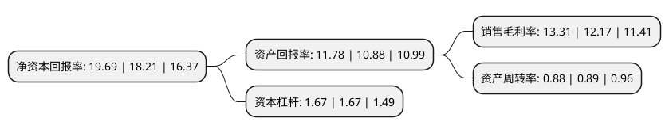

> 本页面由自动化程序生成于 2022年5月20日 01:41
> 内容可能存在错误，如有bug请提交issue至：https://github.com/Eroleice/doc-pi/issues
{.is-warning}

# 上市公司基本情况

## 基本资料

江苏威博液压股份有限公司（以下简称“威博液压”）成立于2003年01月20日，淮安市。于2022年01月06日在北交所北交所上市。

威博液压注册资本4,875万元，液压动力单元和液压齿轮泵以下是详细信息：

- 公司名称: 江苏威博液压股份有限公司
- 股票代码: 871245.BJ
- 所在地: 江苏 - 淮安市
- 成立日期: 2003年01月20日
- 注册资本: 4,875万元
- 法定代表人: 马金星
- 主营业务: 液压动力单元和液压齿轮泵
- 公司官网: www.vibo-hydraulics.com
- 公司介绍: 公司的主营业务为：专业从事液压动力单元的研发、生产及销售。液压动力单元(HPU)用作供油装置，它通过外部的管路系统与数个液压油缸相连以控制多组阀门动作。通过动力油源系统将原动机的机械能转换成油液的压力能，向整个液压传动系统提供动力，公司产品主要应用于仓储物流设备制造及汽车机械、工程机械、铁路机械等领域等行业领域。

## 股东及高管情况

上市公司第一大股东为淮安豪信液压有限公司，持股14,000,000股，占比28.7179%，**疑似为**上市公司实际控制人。

截至2022年03月31日，上市公司的前十大股东中，共有3名自然人股东，7名机构股东，其中5%以上大股东共有3名。上市公司前十大股东明细如下：

> 未能通过持股比例判定出上市公司实际控制人（持股30%以上）
> 可能存在通过间接持股、联合持股、协议控制等方式拥有实际控制权的主体，具体请参考上市公司定期公告！
{.is-warning}

> 截至2022年03月31日，上市公司前十大股东信息如下：

| 股东名称 | 持股数量（股） | 持股比例 |
| --- | --- | --- |
| 淮安豪信液压有限公司 | 14,000,000 | 28.7179% |
| 马金星 | 7,493,717 | 15.3717% |
| 淮安众博信息咨询服务有限公司 | 7,000,000 | 14.359% |
| 淮安科创产业投资有限公司 | 2,350,000 | 4.8205% |
| 淮安经开创业投资有限公司 | 2,350,000 | 4.8205% |
| 董兰波 | 2,000,000 | 4.1026% |
| 海宁海睿投资管理有限公司-海宁海睿产业投资合伙企业(有限合伙) | 2,000,000 | 4.1026% |
| 虞炳泉 | 900,000 | 1.8462% |
| 徐工集团创投发展(徐州)有限公司 | 300,000 | 0.6154% |
| 徐州徐工股权投资有限公司-扬中市徐工产业投资合伙企业(有限合伙) | 300,000 | 0.6154% |

## 利润表分析

上市公司2021年总收入为3.16亿元，净利润为0.42亿元，实现盈利。

## 杜邦分析

> 数据列示周期：2021年 | 2020年 | 2019年
{.is-info}

上市公司的净资产收益率在近一年有所上升，上升幅度为8.13%，其变化情况分解如下：
- 上市公司的销售毛利率在近一年上升了9.37%，可能是生产效率的提升、商品原材料价格下跌或商品价格的上涨所致。
- 上市公司的资产周转率在近一年下降了-1.12%，可能是源自于更慢的销售回款或库存管理效果下降。
- 上市公司的财务杠杆比率在近一年下降了0%，可能是减少负债降低财务费用。

