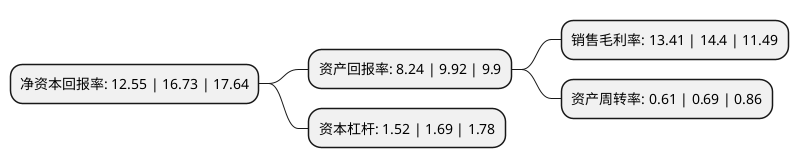

> 本页面由自动化程序生成于 2022年5月20日 01:41
> 内容可能存在错误，如有bug请提交issue至：https://github.com/Eroleice/doc-pi/issues
{.is-warning}

# 上市公司基本情况

## 基本资料

常州电站辅机股份有限公司（以下简称“常辅股份”）成立于1979年01月15日，常州市。于2020年11月18日在北交所北交所上市。

常辅股份注册资本5,326.389万元，阀门执行机构的研发，生产与销售以下是详细信息：

- 公司名称: 常州电站辅机股份有限公司
- 股票代码: 871396.BJ
- 所在地: 江苏 - 常州市
- 成立日期: 1979年01月15日
- 注册资本: 5,326.389万元
- 法定代表人: 杜发平
- 主营业务: 阀门执行机构的研发，生产与销售
- 公司官网: www.czcdf.cn
- 公司介绍: 公司前身为国家定点生产阀门执行机构的三家国有企业之一，上世纪七十年代，参与电力行业国产电动执行机构的研发，2003年通过引进国际先进控制技术，研发出国内第一代智能型电动执行机构。公司主营业务为阀门执行机构的研发、生产与销售。产品广泛应用于核电、石化、冶金、市政、电力等行业和领域。公司为江苏省高新技术企业，产品用于秦山核电站、大亚湾核电站、西气东输、大庆油田等多个国家重大工程项目。公司与国内高等院校、研究院所建立了长期技术合作关系，建有江苏省企业技术中心、工程技术研究中心和研究生工作站，为智能型阀门电动装置国家标准(GB/T28270-2012)主要起草单位，江苏省高新技术产业化火炬计划项目单位。

## 股东及高管情况

上市公司第一大股东为杜发平，持股14,799,174股，占比27.78%，**疑似为**上市公司实际控制人。

截至2022年03月31日，上市公司的前十大股东中，共有8名自然人股东，2名机构股东，其中5%以上大股东共有2名。上市公司前十大股东明细如下：

> 未能通过持股比例判定出上市公司实际控制人（持股30%以上）
> 可能存在通过间接持股、联合持股、协议控制等方式拥有实际控制权的主体，具体请参考上市公司定期公告！
{.is-warning}

> 截至2022年03月31日，上市公司前十大股东信息如下：

| 股东名称 | 持股数量（股） | 持股比例 |
| --- | --- | --- |
| 杜发平 | 14,799,174 | 27.78% |
| 中核苏阀科技实业股份有限公司 | 4,760,888 | 8.94% |
| 姜迎新 | 2,515,558 | 4.72% |
| 张家东 | 2,308,209 | 4.33% |
| 苏建湧 | 2,109,532 | 3.96% |
| 姜义兴 | 2,062,232 | 3.87% |
| 张雪梅 | 1,821,454 | 3.42% |
| 常州市双灵企业管理咨询合伙企业(有限合伙) | 1,248,000 | 2.34% |
| 汪旼 | 1,014,917 | 1.91% |
| 周建辉 | 964,000 | 1.81% |

## 利润表分析

上市公司2021年总收入为2.27亿元，净利润为0.3亿元，实现盈利。

## 杜邦分析

> 数据列示周期：2021年 | 2020年 | 2019年
{.is-info}

上市公司的净资产收益率在近一年有所下降，下降幅度为-24.99%，其变化情况分解如下：
- 上市公司的销售毛利率在近一年下降了-6.87%，可能是生产效率的下降、商品原材料价格上涨或商品价格的下跌所致。
- 上市公司的资产周转率在近一年下降了-11.59%，可能是源自于更慢的销售回款或库存管理效果下降。
- 上市公司的财务杠杆比率在近一年下降了-10.06%，可能是减少负债降低财务费用。

