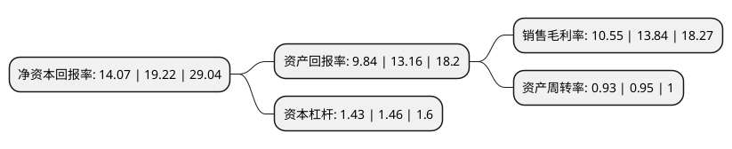

> 本页面由自动化程序生成于 2022年5月20日 01:41
> 内容可能存在错误，如有bug请提交issue至：https://github.com/Eroleice/doc-pi/issues
{.is-warning}

# 上市公司基本情况

## 基本资料

北京凯腾精工制版股份有限公司（以下简称“凯腾精工”）成立于2003年09月27日，北京市。于2021年08月06日在北交所北交所上市。

凯腾精工注册资本14,369.046万元，印刷行业中重要耗材凹印印版的研发，生产和销售以下是详细信息：

- 公司名称: 北京凯腾精工制版股份有限公司
- 股票代码: 871553.BJ
- 所在地: 北京 - 北京市
- 成立日期: 2003年09月27日
- 注册资本: 14,369.046万元
- 法定代表人: 李文田
- 主营业务: 印刷行业中重要耗材凹印印版的研发，生产和销售
- 公司官网: www.ktjg.com.cn
- 公司介绍: 公司专注凹印印版的研发、生产和销售。经过二十余年的发展，公司已经成为国内印刷印版行业的知名企业。凭借公司先进的生产技术、先进设备、优秀的生产组织能力、严格的质量控制体系和出色的全程客服模式，在行业内形成了良好的口碑。公司利用自己在行业内的知名度和对行业的深入理解，为客户提供质量可靠的产品，以保持公司稳定上升的盈利能力。

## 股东及高管情况

上市公司第一大股东为北京凯腾精达管理咨询服务合伙企业(有限合伙)，持股67,126,838股，占比46.72%，为上市公司实际控制人。

截至2022年03月31日，上市公司的前十大股东中，共有9名自然人股东，1名机构股东，其中5%以上大股东共有1名。上市公司前十大股东明细如下：

> 截至2022年03月31日，上市公司前十大股东信息如下：

| 股东名称 | 持股数量（股） | 持股比例 |
| --- | --- | --- |
| 北京凯腾精达管理咨询服务合伙企业(有限合伙) | 67,126,838 | 46.72% |
| 李平珍 | 4,954,844 | 3.45% |
| 高少成 | 4,727,644 | 3.29% |
| 姚霞霞 | 4,111,460 | 2.86% |
| 刘小英 | 3,721,672 | 2.59% |
| 刘芬 | 3,004,523 | 2.09% |
| 李文义 | 2,866,422 | 1.99% |
| 焦肖军 | 2,866,422 | 1.99% |
| 田倩倩 | 2,000,000 | 1.39% |
| 姚彩霞 | 1,807,846 | 1.26% |

## 利润表分析

上市公司2021年总收入为3.93亿元，净利润为0.41亿元，实现盈利。

## 杜邦分析

> 数据列示周期：2021年 | 2020年 | 2019年
{.is-info}

上市公司的净资产收益率在近一年有所下降，下降幅度为-26.8%，其变化情况分解如下：
- 上市公司的销售毛利率在近一年下降了-23.77%，可能是生产效率的下降、商品原材料价格上涨或商品价格的下跌所致。
- 上市公司的资产周转率在近一年下降了-2.11%，可能是源自于更慢的销售回款或库存管理效果下降。
- 上市公司的财务杠杆比率在近一年下降了-2.05%，可能是减少负债降低财务费用。

