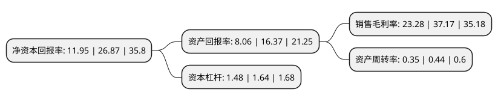

> 本页面由自动化程序生成于 2022年5月20日 01:41
> 内容可能存在错误，如有bug请提交issue至：https://github.com/Eroleice/doc-pi/issues
{.is-warning}

# 上市公司基本情况

## 基本资料

南通通易航天科技股份有限公司（以下简称“通易航天”）成立于2008年03月20日，南通市。于2021年08月16日在北交所北交所上市。

通易航天注册资本7,405.02万元，公司主要从事军用特种航空制品以及聚氨酯，碳纤维等材料制品的研发，生产和销售，主要产品包括航空供氧面罩，聚氨酯保护膜，飞机橡胶软油箱，变压器储油柜胶囊(隔膜)，碳纤维窗框，特种纺织布等。以下是详细信息：

- 公司名称: 南通通易航天科技股份有限公司
- 股票代码: 871642.BJ
- 所在地: 江苏 - 南通市
- 成立日期: 2008年03月20日
- 注册资本: 7,405.02万元
- 法定代表人: 张欣戎
- 主营业务: 公司主要从事军用特种航空制品以及聚氨酯，碳纤维等材料制品的研发，生产和销售，主要产品包括航空供氧面罩，聚氨酯保护膜，飞机橡胶软油箱，变压器储油柜胶囊(隔膜)，碳纤维窗框，特种纺织布等
- 公司官网: null
- 公司介绍: 公司主营业务为军用特种航空制品及民用橡胶制品的研发、生产和销售，公司产品主要为特种橡胶制品，主要包括航空供氧面罩、橡胶软油箱、变压器油囊、航天航空及核工业设备用密封件，主要应用于航天、航空、电力等领域。产品均按客户需求设计生产，属非标产品拨款研制及订货生产。产品由公司技术部负责研制，由生产部负责生产实施，采购部、质检部销售部为配套部门。同时，公司还利用自身军民两用工艺技术优势和质量管理优势以及渠道优势，经营部分民用橡胶零件、储油柜胶囊、胶布及特种橡胶燃油油箱的生产销售以及橡胶及橡胶制品相关的原材料的贸易业务。

## 股东及高管情况

上市公司第一大股东为深圳易行健创业投资有限公司，持股32,157,800股，占比43.43%，为上市公司实际控制人。

截至2022年03月31日，上市公司的前十大股东中，共有6名自然人股东，3名机构股东，1个产品账户，其中5%以上大股东共有2名。上市公司前十大股东明细如下：

> 截至2022年03月31日，上市公司前十大股东信息如下：

| 股东名称 | 持股数量（股） | 持股比例 |
| --- | --- | --- |
| 深圳易行健创业投资有限公司 | 32,157,800 | 43.43% |
| 黎又佳 | 3,870,000 | 5.23% |
| 中信证券股份有限公司 | 3,064,400 | 4.14% |
| 张欣戎 | 2,488,000 | 3.36% |
| 蒋炜 | 2,388,200 | 3.23% |
| 上海炽一企业管理咨询合伙企业(有限合伙) | 2,170,000 | 2.93% |
| 冯勤 | 1,986,000 | 2.68% |
| 王志兰 | 1,500,000 | 2.03% |
| 刘馨莉 | 1,469,100 | 1.98% |
| 中国工商银行股份有限公司-汇添富北交所创新精选两年定期开放混合型证券投资基金 | 1,065,311 | 1.44% |

## 利润表分析

上市公司2021年总收入为1.04亿元，净利润为0.24亿元，实现盈利。

## 杜邦分析

> 数据列示周期：2021年 | 2020年 | 2019年
{.is-info}

上市公司的净资产收益率在近一年有所下降，下降幅度为-55.53%，其变化情况分解如下：
- 上市公司的销售毛利率在近一年下降了-37.37%，可能是生产效率的下降、商品原材料价格上涨或商品价格的下跌所致。
- 上市公司的资产周转率在近一年下降了-20.45%，可能是源自于更慢的销售回款或库存管理效果下降。
- 上市公司的财务杠杆比率在近一年下降了-9.76%，可能是减少负债降低财务费用。

