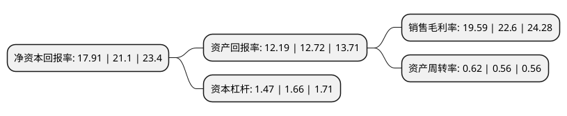

> 本页面由自动化程序生成于 2022年5月20日 01:41
> 内容可能存在错误，如有bug请提交issue至：https://github.com/Eroleice/doc-pi/issues
{.is-warning}

## 股东及高管情况

上市公司第一大股东为闫和平，持股26,623,000股，占比47.58%，为上市公司实际控制人。

截至2022年05月18日，上市公司的前十大股东中，共有8名自然人股东，1名机构股东，1个产品账户，其中5%以上大股东共有2名。上市公司前十大股东明细如下：

> 截至2022年05月18日，上市公司前十大股东信息如下：

| 股东名称 | 持股数量（股） | 持股比例 |
| --- | --- | --- |
| 闫和平 | 26,623,000 | 47.58% |
| 宁波梅山保税港区厚扬天灏股权投资中心(有限合伙) | 5,652,000 | 10.1% |
| 彭水源 | 1,185,000 | 2.12% |
| 孙明军 | 872,000 | 1.56% |
| 任宁波 | 600,300 | 1.07% |
| 闫雷鹏 | 560,000 | 1% |
| 刘泽荣 | 470,000 | 0.84% |
| 深圳市丹桂顺资产管理有限公司(丹桂顺之实事求是伍号私募证券投资基金) | 450,000 | 0.8% |
| 杨会雷 | 400,000 | 0.71% |
| 赵军 | 350,000 | 0.63% |

## 杜邦分析

> 数据列示周期：2021年 | 2020年 | 2019年
{.is-info}

上市公司的净资产收益率在近一年有所下降，下降幅度为-15.12%，其变化情况分解如下：
- 上市公司的销售毛利率在近一年下降了-13.32%，可能是生产效率的下降、商品原材料价格上涨或商品价格的下跌所致。
- 上市公司的资产周转率在近一年上升了10.71%，可能是源自于更快的销售回款或库存管理效果提升。
- 上市公司的财务杠杆比率在近一年下降了-11.45%，可能是减少负债降低财务费用。

