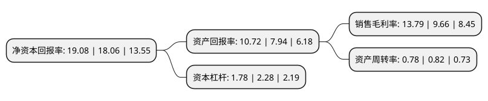

> 本页面由自动化程序生成于 2022年5月20日 01:41
> 内容可能存在错误，如有bug请提交issue至：https://github.com/Eroleice/doc-pi/issues
{.is-warning}

# 上市公司基本情况

## 基本资料

安徽晶赛科技股份有限公司（以下简称“晶赛科技”）成立于2005年01月20日，铜陵市。于2021年11月15日在北交所北交所上市。

晶赛科技注册资本5,462万元，石英晶振及封装材料的设计，研发，生产及销售以下是详细信息：

- 公司名称: 安徽晶赛科技股份有限公司
- 股票代码: 871981.BJ
- 所在地: 安徽 - 铜陵市
- 成立日期: 2005年01月20日
- 注册资本: 5,462万元
- 法定代表人: 侯诗益
- 主营业务: 石英晶振及封装材料的设计，研发，生产及销售
- 公司官网: www.tljsjm.cn
- 公司介绍: 公司自成立以来，专注于石英晶体元器件及其封装材料的研发、生产及销售。根据中国证监会《上市公司行业分类指引》(2012年修订版)，公司属于C39计算机、通讯和其他电子设备制造业；根据《国民经济行业分类标准》(GBT4754－2011)，公司属于C3971电子元件及组件制造；根据《挂牌公司管理型行业分类指引》，公司属于C3971电子元件及组件制造。公司产品主要分为两大类。一类为石英晶体元器件封装材料，另一类为石英晶体元器件。

## 股东及高管情况

上市公司第一大股东为侯诗益，持股20,983,000股，占比38.42%，为上市公司实际控制人。

截至2022年03月31日，上市公司的前十大股东中，共有3名自然人股东，5名机构股东，2个产品账户，其中5%以上大股东共有3名。上市公司前十大股东明细如下：

> 截至2022年03月31日，上市公司前十大股东信息如下：

| 股东名称 | 持股数量（股） | 持股比例 |
| --- | --- | --- |
| 侯诗益 | 20,983,000 | 38.42% |
| 侯雪 | 14,701,200 | 26.92% |
| 铜陵晶超投资管理有限合伙企业(有限合伙) | 2,800,000 | 5.13% |
| 铜陵晶益投资管理有限合伙企业(有限合伙) | 1,050,000 | 1.92% |
| 铜陵安元投资基金有限公司 | 880,400 | 1.61% |
| 广州视源电子科技股份有限公司 | 545,850 | 1% |
| 樊雷刚 | 345,000 | 0.63% |
| 安信证券股份有限公司 | 303,000 | 0.55% |
| 国元证券股份有限公司 | 263,218 | 0.48% |
| 铜陵国元种子创业投资基金有限公司 | 262,009 | 0.48% |

## 利润表分析

上市公司2021年总收入为4.74亿元，净利润为0.65亿元，实现盈利。

## 杜邦分析

> 数据列示周期：2021年 | 2020年 | 2019年
{.is-info}

上市公司的净资产收益率在近一年有所上升，上升幅度为5.65%，其变化情况分解如下：
- 上市公司的销售毛利率在近一年上升了42.75%，可能是生产效率的提升、商品原材料价格下跌或商品价格的上涨所致。
- 上市公司的资产周转率在近一年下降了-4.88%，可能是源自于更慢的销售回款或库存管理效果下降。
- 上市公司的财务杠杆比率在近一年下降了-21.93%，可能是减少负债降低财务费用。

