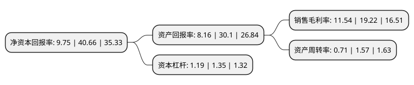

> 本页面由自动化程序生成于 2022年5月20日 01:41
> 内容可能存在错误，如有bug请提交issue至：https://github.com/Eroleice/doc-pi/issues
{.is-warning}

# 上市公司基本情况

## 基本资料

惠州市锦好医疗科技股份有限公司（以下简称“锦好医疗”）成立于2011年08月31日，惠州市。于2021年10月25日在北交所北交所上市。

锦好医疗注册资本4,860万元，医疗电子产品的研发，生产及销售以下是详细信息：

- 公司名称: 惠州市锦好医疗科技股份有限公司
- 股票代码: 872925.BJ
- 所在地: 广东 - 惠州市
- 成立日期: 2011年08月31日
- 注册资本: 4,860万元
- 法定代表人: 王敏
- 主营业务: 医疗电子产品的研发，生产及销售
- 公司官网: www.jinghao.cc
- 公司介绍: 公司主营业务为医疗电子产品的研发、生产及销售，主要产品为助听器、雾化器、防褥疮气垫等。生产、加工、销售电子产品：听觉检查音叉、听力计、耳声发射仪、耳声阻抗测量仪、植入式骨导助听器、人工耳蜗声音处理器、骨桥声音处理器、骨导声音处理器、听觉康复训练仪、耳背式、耳内式、盒式、骨导式助听器；便携式氧气呼吸器、便携式制氧机、医用呼吸道湿化器、医用氧气湿化器、雾化管、雾化吸入管、雾化面罩、医用超声雾化器、压缩式雾化器、医用雾化器、喷雾器、雾化组件；玻璃体温计、体温计、电子体温计、脉搏血氧仪、血压计、血糖仪；电动轮椅车、手动轮椅车、医用拐、肘拐、助行器、站立架电热毯、医用防褥床气垫、胎心仪、吸奶器、拔火罐、干燥剂、理疗仪、脉搏器；货物及技术进出口(依法须经批准的项目,经相关部门批准后方可开展经营活动)。公司主营业务为医疗电子产品的研发、生产及销售，主要产品为助听器、雾化器、防褥疮气垫等。

## 股东及高管情况

上市公司第一大股东为王敏，持股12,668,057股，占比26.07%，**疑似为**上市公司实际控制人。

截至2022年03月31日，上市公司的前十大股东中，共有2名自然人股东，6名机构股东，2个产品账户，其中5%以上大股东共有4名。上市公司前十大股东明细如下：

> 未能通过持股比例判定出上市公司实际控制人（持股30%以上）
> 可能存在通过间接持股、联合持股、协议控制等方式拥有实际控制权的主体，具体请参考上市公司定期公告！
{.is-warning}

> 截至2022年03月31日，上市公司前十大股东信息如下：

| 股东名称 | 持股数量（股） | 持股比例 |
| --- | --- | --- |
| 王敏 | 12,668,057 | 26.07% |
| 王芳 | 9,491,818 | 19.53% |
| 惠州市锦同创投资有限责任公司 | 4,738,126 | 9.75% |
| 博尔乐远东有限公司 | 3,500,001 | 7.2% |
| 中信建投投资有限公司 | 1,772,263 | 3.65% |
| 惠州市锦同声投资合伙企业(有限合伙) | 1,574,996 | 3.24% |
| 惠州市锦同盛投资合伙企业(有限合伙) | 1,496,248 | 3.08% |
| 中国工商银行股份有限公司-汇添富北交所创新精选两年定期开放混合型证券投资基金 | 937,298 | 1.93% |
| 晨鸣(青岛)资产管理有限公司-青岛晨融鼎合私募股权投资基金合伙企业(有限合伙) | 571,618 | 1.18% |
| 惠州市宇光电子工贸有限公司 | 505,952 | 1.04% |

## 利润表分析

上市公司2021年总收入为1.91亿元，净利润为0.22亿元，实现盈利。

## 杜邦分析

> 数据列示周期：2021年 | 2020年 | 2019年
{.is-info}

上市公司的净资产收益率在近一年有所下降，下降幅度为-76.02%，其变化情况分解如下：
- 上市公司的销售毛利率在近一年下降了-39.96%，可能是生产效率的下降、商品原材料价格上涨或商品价格的下跌所致。
- 上市公司的资产周转率在近一年下降了-54.78%，可能是源自于更慢的销售回款或库存管理效果下降。
- 上市公司的财务杠杆比率在近一年下降了-11.85%，可能是减少负债降低财务费用。

