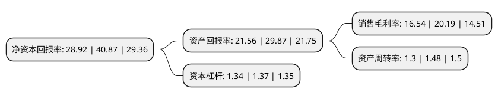

> 本页面由自动化程序生成于 2022年5月20日 01:41
> 内容可能存在错误，如有bug请提交issue至：https://github.com/Eroleice/doc-pi/issues
{.is-warning}

## 股东及高管情况

上市公司第一大股东为陈跃忠，持股34,052,000股，占比43.35%，为上市公司实际控制人。

截至2022年04月15日，上市公司的前十大股东中，共有9名自然人股东，1名机构股东，其中5%以上大股东共有3名。上市公司前十大股东明细如下：

> 截至2022年04月15日，上市公司前十大股东信息如下：

| 股东名称 | 持股数量（股） | 持股比例 |
| --- | --- | --- |
| 陈跃忠 | 34,052,000 | 43.35% |
| 海盐七丰投资咨询有限公司 | 10,795,050 | 13.74% |
| 蔡学群 | 5,359,000 | 6.82% |
| 沈琮 | 2,619,148 | 3.33% |
| 唐其良 | 1,670,000 | 2.13% |
| 黄秀良 | 670,000 | 0.85% |
| 崔进锋 | 670,000 | 0.85% |
| 张福良 | 670,000 | 0.85% |
| 阚益 | 340,000 | 0.43% |
| 金甲欣 | 151,000 | 0.19% |

## 利润表分析

上市公司2021年总收入为2.19亿元，净利润为0.36亿元，实现盈利。

## 杜邦分析

> 数据列示周期：2021年 | 2020年 | 2019年
{.is-info}

上市公司的净资产收益率在近一年有所下降，下降幅度为-29.24%，其变化情况分解如下：
- 上市公司的销售毛利率在近一年下降了-18.08%，可能是生产效率的下降、商品原材料价格上涨或商品价格的下跌所致。
- 上市公司的资产周转率在近一年下降了-12.16%，可能是源自于更慢的销售回款或库存管理效果下降。
- 上市公司的财务杠杆比率在近一年下降了-2.19%，可能是减少负债降低财务费用。

