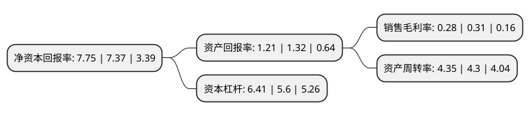

> 本页面由自动化程序生成于 2022年5月20日 01:04
> 内容可能存在错误，如有bug请提交issue至：https://github.com/Eroleice/doc-pi/issues
{.is-warning}

# 上市公司基本情况

## 基本资料

天音通信控股股份有限公司（以下简称“天音控股”）成立于1997年11月07日，赣州市。于1997年12月02日在深交所主板上市。

天音控股注册资本102,510.044万元，主要产品:移动通讯产品销售，酒类产品销售以下是详细信息：

- 公司名称: 天音通信控股股份有限公司
- 股票代码: 000829.SZ
- 所在地: 江西 - 赣州市
- 成立日期: 1997年11月07日
- 注册资本: 102,510.044万元
- 法定代表人: 黄绍文
- 主营业务: 主要产品:移动通讯产品销售，酒类产品销售
- 公司官网: www.chinatelling.com
- 公司介绍: 公司现已发展成为互联网营销、移动互联、移动通信、彩票等业务为一体的集团化公司。互联网营销方面，公司积极布局并引入苹果、三星、华为、小米、魅族等主流手机品牌代理权的同时，大力发展以天联网为代表的B2B垂直型电商平台，进一步推进线上线下渠道资源结合，布局了行业领先的营销网络；移动互联网方面，塔读文学位列中国移动阅读市场前三强，欧朋浏览器为中国手机浏览器前四强；移动通信方面，率先完成了国内全运营商10033客服备案及开通，成为初次开通转售170号段开往放号并推出基础通信产品的虚拟运营商；2015年底并购掌信彩通后，公司拥有彩票行业福体彩双重准入资质，市场地位领先，业内资源稀缺，并设立“天联彩”彩票投资平台，开启彩票全产业链布局。打造了业内领先的集分销、零售、售后服务、移动互联网、移动通信虚拟运营、彩票为一体的综合服务网络。旗下各业务板块颇具协同效应，并在各个行业领域名列前茅。目前，互联网营销产业集团是国内卓越移动电话综合服务商之一，移动互联产业集团是国内具潜力的移动互联网企业之一，移动转售产业集团为中国早期的移动通信虚拟运营商，并购的掌信彩通是彩票行业的龙头企业之一。

## 股东及高管情况

上市公司第一大股东为深圳市投资控股有限公司，持股195,032,514股，占比19.03%，**疑似为**上市公司实际控制人。

截至2022年03月31日，上市公司的前十大股东中，共有3名自然人股东，6名机构股东，1个海外主体，其中5%以上大股东共有3名。上市公司前十大股东明细如下：

> 未能通过持股比例判定出上市公司实际控制人（持股30%以上）
> 可能存在通过间接持股、联合持股、协议控制等方式拥有实际控制权的主体，具体请参考上市公司定期公告！
{.is-warning}

> 截至2022年03月31日，上市公司前十大股东信息如下：

| 股东名称 | 持股数量（股） | 持股比例 |
| --- | --- | --- |
| 深圳市投资控股有限公司 | 195,032,514 | 19.03% |
| 深圳市天富锦创业投资有限责任公司 | 100,474,022 | 9.8% |
| 中国华建投资控股有限公司 | 80,081,582 | 7.81% |
| 北京国际信托有限公司-天音控股股权投资信托(原赣南果业) | 51,157,019 | 4.99% |
| 深圳市鼎鹏投资有限公司 | 18,755,010 | 1.83% |
| 香港中央结算有限公司(陆股通) | 10,460,257 | 1.02% |
| 吴贵州 | 7,171,400 | 0.7% |
| 深圳市聚海投资发展有限公司 | 6,011,820 | 0.59% |
| 许利民 | 5,138,600 | 0.5% |
| 曾蔚玲 | 4,140,111 | 0.4% |

## 利润表分析

上市公司2021年总收入为709.99亿元，净利润为1.97亿元，实现盈利。

## 杜邦分析

> 数据列示周期：2021年 | 2020年 | 2019年
{.is-info}

上市公司的净资产收益率在近一年有所上升，上升幅度为5.16%，其变化情况分解如下：
- 上市公司的销售毛利率在近一年下降了-9.68%，可能是生产效率的下降、商品原材料价格上涨或商品价格的下跌所致。
- 上市公司的资产周转率在近一年上升了1.16%，可能是源自于更快的销售回款或库存管理效果提升。
- 上市公司的财务杠杆比率在近一年上升了14.46%，可能是增加负债扩大生产规模。

