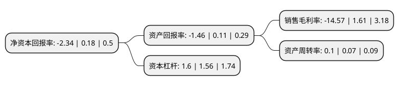

> 本页面由自动化程序生成于 2022年5月20日 01:04
> 内容可能存在错误，如有bug请提交issue至：https://github.com/Eroleice/doc-pi/issues
{.is-warning}

# 上市公司基本情况

## 基本资料

北京华联商厦股份有限公司（以下简称“华联股份”）成立于1998年05月29日，北京市。于1998年06月16日在深交所主板上市。

华联股份注册资本273,735.195万元，主要业务:百货零售。以下是详细信息：

- 公司名称: 北京华联商厦股份有限公司
- 股票代码: 000882.SZ
- 所在地: 北京 - 北京市
- 成立日期: 1998年05月29日
- 注册资本: 273,735.195万元
- 法定代表人: 王锐
- 主营业务: 百货零售
- 公司官网: www.bhgmall.com.cn
- 公司介绍: 公司是中国最大的零售企业集团之一，在零售业拥有多年的经营经验，已成为了一个街知巷闻的品牌，也是中国商务部重点扶持的国内最大零售集团之一。公司核心业务分别涵盖：超市、高端百货、购物中心以及国际合作、品牌特许经营。集团业务遍及全国多个省和主要城市。公司具有丰富的商业零售行业经营管理经验，集团系统拥有成熟的商业零售网络体系，使公司能够获取新的商业地产信息资源，能够更准确地选定新的商业地产开发项目，具备从事商业地产开发运营管理的先天优势。

## 股东及高管情况

上市公司第一大股东为北京华联集团投资控股有限公司，持股749,644,537股，占比27.39%，**疑似为**上市公司实际控制人。

截至2022年03月31日，上市公司的前十大股东中，共有2名自然人股东，3名机构股东，4个产品账户，1个海外主体，其中5%以上大股东共有2名。上市公司前十大股东明细如下：

> 未能通过持股比例判定出上市公司实际控制人（持股30%以上）
> 可能存在通过间接持股、联合持股、协议控制等方式拥有实际控制权的主体，具体请参考上市公司定期公告！
{.is-warning}

> 截至2022年03月31日，上市公司前十大股东信息如下：

| 股东名称 | 持股数量（股） | 持股比例 |
| --- | --- | --- |
| 北京华联集团投资控股有限公司 | 749,644,537 | 27.39% |
| 西藏山南信商投资管理有限公司 | 255,192,878 | 9.32% |
| 昊泽致远(北京)投资管理有限公司-昊泽晨曦7号私募证券投资基金 | 78,939,531 | 2.88% |
| 北京世纪国光科贸有限公司 | 67,616,750 | 2.47% |
| 上海磐耀资产管理有限公司-磐耀通享12号私募证券投资基金 | 58,070,700 | 2.12% |
| 昊泽致远(北京)投资管理有限公司-昊泽晨曦3号私募证券投资基金 | 33,083,411 | 1.21% |
| UBS   AG | 10,035,225 | 0.37% |
| 谭有莲 | 8,960,200 | 0.33% |
| 黄和平 | 7,940,600 | 0.29% |
| 华夏基金-中央汇金资产管理有限责任公司-华夏基金-汇金资管单一资产管理计划 | 7,095,000 | 0.26% |

## 利润表分析

上市公司2021年总收入为12.18亿元，净利润为-1.78亿元，**未实现盈利**。

## 杜邦分析

> 数据列示周期：2021年 | 2020年 | 2019年
{.is-info}

上市公司的净资产收益率在近一年有所下降，下降幅度为-1400%，其变化情况分解如下：
- 上市公司的销售毛利率在近一年下降了-1004.97%，可能是生产效率的下降、商品原材料价格上涨或商品价格的下跌所致。
- 上市公司的资产周转率在近一年上升了42.86%，可能是源自于更快的销售回款或库存管理效果提升。
- 上市公司的财务杠杆比率在近一年上升了2.56%，可能是增加负债扩大生产规模。

