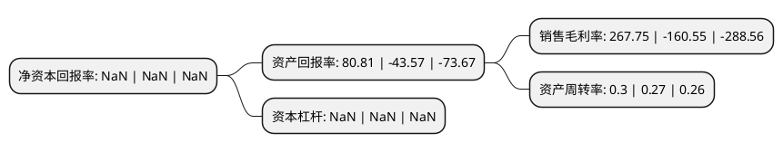

> 本页面由自动化程序生成于 2022年5月20日 01:08
> 内容可能存在错误，如有bug请提交issue至：https://github.com/Eroleice/doc-pi/issues
{.is-warning}

# 上市公司基本情况

## 基本资料

深圳赫美集团股份有限公司（以下简称“*ST赫美”）成立于1994年11月02日，深圳市。于2010年02月09日在深交所中小板上市。

*ST赫美注册资本131,125.452万元，电子式电能表及电力自动化管理系统及终端系列产品研发，生产，销售。本公司主要产品包括全电子式电能表系列产品和用电自动化管理系统及终端产品。电子式电能表系列主要包括单相电子式电能表和三相电子式电能表两个大类。以下是详细信息：

- 公司名称: 深圳赫美集团股份有限公司
- 股票代码: 002356.SZ
- 所在地: 广东 - 深圳市
- 成立日期: 1994年11月02日
- 注册资本: 131,125.452万元
- 法定代表人: 王磊
- 主营业务: 电子式电能表及电力自动化管理系统及终端系列产品研发，生产，销售本公司主要产品包括全电子式电能表系列产品和用电自动化管理系统及终端产品电子式电能表系列主要包括单相电子式电能表和三相电子式电能表两个大类
- 公司官网: www.hemei.cn
- 公司介绍: 公司定位于“国际品牌运营的服务商”，集中发力高端消费领域，从品牌培育、门店运营、渠道拓展、形象维护、销售服务和配套售后等方面，为国际高端品牌提供多元运营服务，助力国际品牌更好地在中国落地和发展；公司打造赫美会员系统，通过积分返利的方式，打破区域、品牌、品类壁垒，为客户提供全品牌多品类的高端消费商品及服务，降低客户购买成本，创建高品质生活方式。公司旗下现有赫美商业、赫美旅业、赫美传媒、浩美资产、上海欧蓝、崇高百货、彩虹中国区、赫美万宏、欧祺亚、赫美智慧科技等子公司。拥有多家门店遍布于北京、上海、广州、深圳、杭州等国内一、二、三线城市的近多个商业地产中心，品类涉及饰品、珠宝、男装、女装、休闲装、运动装、童装、鞋类等品质生活的方方面面。集团在国际品牌界形成了强大的影响力，成为国际品牌进入国内的首选合作运营商之一。

## 股东及高管情况

上市公司第一大股东为海南时代榕光实业投资合伙企业(有限合伙)，持股224,386,125股，占比17.11%，**疑似为**上市公司实际控制人。

截至2022年03月31日，上市公司的前十大股东中，共有2名自然人股东，6名机构股东，2个产品账户，其中5%以上大股东共有4名。上市公司前十大股东明细如下：

> 未能通过持股比例判定出上市公司实际控制人（持股30%以上）
> 可能存在通过间接持股、联合持股、协议控制等方式拥有实际控制权的主体，具体请参考上市公司定期公告！
{.is-warning}

> 截至2022年03月31日，上市公司前十大股东信息如下：

| 股东名称 | 持股数量（股） | 持股比例 |
| --- | --- | --- |
| 海南时代榕光实业投资合伙企业(有限合伙) | 224,386,125 | 17.11% |
| 深圳赫美集团股份有限公司破产企业财产处置专用账户 | 178,911,541 | 13.64% |
| 王雨霏 | 156,102,630 | 11.9% |
| 汉桥机器厂有限公司 | 125,018,000 | 9.53% |
| 郝毅 | 61,101,341 | 4.66% |
| 吉林环城农村商业银行股份有限公司 | 57,842,310 | 4.41% |
| 孝义市富源金来热源有限公司 | 45,529,934 | 3.47% |
| 西藏信托有限公司-西藏信托-华歆8号集合资金信托计划 | 38,531,177 | 2.94% |
| 北京美瑞泰富投资管理有限公司 | 15,520,000 | 1.18% |
| 杭州阅赢投资管理合伙企业(有限合伙) | 12,980,120 | 0.99% |

## 利润表分析

上市公司2021年总收入为3.32亿元，净利润为8.91亿元，实现盈利。

## 杜邦分析

> 数据列示周期：2021年 | 2020年 | 2019年
{.is-info}

上市公司的净资产收益率在近一年有所下降，下降幅度为NaN%，其变化情况分解如下：
- 上市公司的销售毛利率在近一年下降了-266.77%，可能是生产效率的下降、商品原材料价格上涨或商品价格的下跌所致。
- 上市公司的资产周转率在近一年上升了11.11%，可能是源自于更快的销售回款或库存管理效果提升。
- 上市公司的财务杠杆比率在近一年下降了NaN%，可能是减少负债降低财务费用。

