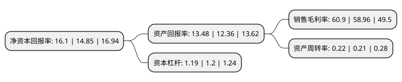

> 本页面由自动化程序生成于 2022年5月20日 01:12
> 内容可能存在错误，如有bug请提交issue至：https://github.com/Eroleice/doc-pi/issues
{.is-warning}

# 上市公司基本情况

## 基本资料

成都富森美家居股份有限公司（以下简称“富森美”）成立于2000年12月07日，成都市。于2016年11月09日在深交所中小板上市。

富森美注册资本74,845.894万元，主营业务:装饰建材家居和汽配市场的开发，租赁和服务。以下是详细信息：

- 公司名称: 成都富森美家居股份有限公司
- 股票代码: 002818.SZ
- 所在地: 四川 - 成都市
- 成立日期: 2000年12月07日
- 注册资本: 74,845.894万元
- 法定代表人: 刘兵
- 主营业务: 主营业务:装饰建材家居和汽配市场的开发，租赁和服务
- 公司官网: www.fsmjj.cn
- 公司介绍: 公司系国内专业致力于大型建材家居商业卖场投资开发、运营管理、营销策划的现代商贸服务型企业。公司秉承“创行业一流、做百年老店”的愿景，坚持以创造共赢为目标，以品牌运营为核心，以营销服务为支撑，以价值链管理为根本，以产业聚合和业态创新为方式。公司相继被中宣部等八部委联合授予“全国百城万店无假货示范市场”；国家工商总局授予“全国诚信示范市场”；国家质检总局授予“全国购物放心市场”；四川省人民政府授予“四川省服务名牌企业”“四川省优秀民营企业”；成都市人民政府授予“突出贡献民营企业”等荣誉称号。

## 股东及高管情况

上市公司第一大股东为刘兵，持股327,100,886股，占比43.7%，为上市公司实际控制人。

截至2022年03月31日，上市公司的前十大股东中，共有5名自然人股东，3名机构股东，1个产品账户，1个海外主体，其中5%以上大股东共有3名。上市公司前十大股东明细如下：

> 截至2022年03月31日，上市公司前十大股东信息如下：

| 股东名称 | 持股数量（股） | 持股比例 |
| --- | --- | --- |
| 刘兵 | 327,100,886 | 43.7% |
| 刘云华 | 207,345,600 | 27.7% |
| 刘义 | 65,165,760 | 8.71% |
| 香港中央结算有限公司(陆股通) | 8,885,574 | 1.19% |
| 成都博源天鸿投资合伙企业(有限合伙) | 5,300,570 | 0.71% |
| 光大永明人寿保险有限公司-分红险 | 3,634,230 | 0.49% |
| 光大永明人寿保险有限公司-自有资金 | 3,523,540 | 0.47% |
| 光大永明资管-建设银行-光大永明资产优势精选集合资产管理产品 | 2,399,930 | 0.32% |
| 傅刚 | 1,995,000 | 0.27% |
| 刘鹏俊 | 1,905,499 | 0.25% |

## 利润表分析

上市公司2021年总收入为15.36亿元，净利润为9.35亿元，实现盈利。

## 杜邦分析

> 数据列示周期：2021年 | 2020年 | 2019年
{.is-info}

上市公司的净资产收益率在近一年有所上升，上升幅度为8.42%，其变化情况分解如下：
- 上市公司的销售毛利率在近一年上升了3.29%，可能是生产效率的提升、商品原材料价格下跌或商品价格的上涨所致。
- 上市公司的资产周转率在近一年上升了4.76%，可能是源自于更快的销售回款或库存管理效果提升。
- 上市公司的财务杠杆比率在近一年下降了-0.83%，可能是减少负债降低财务费用。

