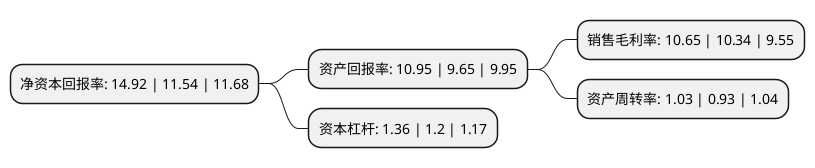

> 本页面由自动化程序生成于 2022年5月20日 01:19
> 内容可能存在错误，如有bug请提交issue至：https://github.com/Eroleice/doc-pi/issues
{.is-warning}

# 上市公司基本情况

## 基本资料

博士眼镜连锁股份有限公司（以下简称“博士眼镜”）成立于1997年04月23日，深圳市。于2017年03月15日在深交所创业板上市。

博士眼镜注册资本17,241.857万元，专业从事眼镜零售的连锁经营企业。销售的主要产品包括:镜架，镜片，太阳镜，老花镜，隐形眼镜，隐形护理液及其他，并向消费者提供视光校正方案咨询，视光产品装配及维修，视光保健服务。以下是详细信息：

- 公司名称: 博士眼镜连锁股份有限公司
- 股票代码: 300622.SZ
- 所在地: 广东 - 深圳市
- 成立日期: 1997年04月23日
- 注册资本: 17,241.857万元
- 法定代表人: ALEXANDER LIU
- 主营业务: 专业从事眼镜零售的连锁经营企业销售的主要产品包括:镜架，镜片，太阳镜，老花镜，隐形眼镜，隐形护理液及其他，并向消费者提供视光校正方案咨询，视光产品装配及维修，视光保健服务
- 公司官网: www.doctorglasses.com.cn
- 公司介绍: 公司是一家从事眼镜零售的连锁经营企业。多年来，公司立足深圳，逐步向全国辐射，是国内销售规模、门店数量领先的眼镜连锁零售企业之一。公司经营网点已遍布深圳、南昌、北京、广州、昆明、重庆、合肥、成都、杭州、沈阳、郑州、南宁、无锡、青岛等多个大、中城市，覆盖全国多个省、自治区、直辖市。公司正处于高速发展阶段。

## 股东及高管情况

上市公司第一大股东为ALEXANDER LIU，持股44,112,595股，占比25.58%，**疑似为**上市公司实际控制人。

截至2022年03月31日，上市公司的前十大股东中，共有7名自然人股东，1名机构股东，2个海外主体，其中5%以上大股东共有2名。上市公司前十大股东明细如下：

> 未能通过持股比例判定出上市公司实际控制人（持股30%以上）
> 可能存在通过间接持股、联合持股、协议控制等方式拥有实际控制权的主体，具体请参考上市公司定期公告！
{.is-warning}

> 截至2022年03月31日，上市公司前十大股东信息如下：

| 股东名称 | 持股数量（股） | 持股比例 |
| --- | --- | --- |
| ALEXANDER LIU | 44,112,595 | 25.58% |
| LOUISA FAN | 38,420,935 | 22.28% |
| 建水县江南道企业管理有限公司 | 3,682,439 | 2.14% |
| 戚利刚 | 3,180,000 | 1.84% |
| 何小妹 | 2,164,500 | 1.26% |
| 杭道夷 | 1,590,300 | 0.92% |
| 唐朝阳 | 1,555,104 | 0.9% |
| 林开尤 | 1,450,000 | 0.84% |
| 张淑林 | 1,447,858 | 0.84% |
| 陈曦 | 1,311,936 | 0.76% |

## 杜邦分析

> 数据列示周期：2021年 | 2020年 | 2019年
{.is-info}

上市公司的净资产收益率在近一年有所上升，上升幅度为29.29%，其变化情况分解如下：
- 上市公司的销售毛利率在近一年上升了3%，可能是生产效率的提升、商品原材料价格下跌或商品价格的上涨所致。
- 上市公司的资产周转率在近一年上升了10.75%，可能是源自于更快的销售回款或库存管理效果提升。
- 上市公司的财务杠杆比率在近一年上升了13.33%，可能是增加负债扩大生产规模。

