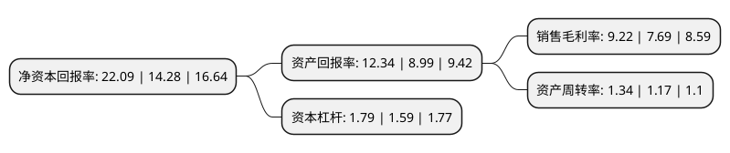

> 本页面由自动化程序生成于 2022年5月20日 01:20
> 内容可能存在错误，如有bug请提交issue至：https://github.com/Eroleice/doc-pi/issues
{.is-warning}

# 上市公司基本情况

## 基本资料

华致酒行连锁管理股份有限公司（以下简称“华致酒行”）成立于2005年05月26日，迪庆藏族自治州。于2019年01月29日在深交所创业板上市。

华致酒行注册资本41,679.84万元，公司的主营业务为酒类连锁销售。主要产品包括白酒，葡萄酒，黄酒等国内外优质酒类产品和多元化的服务。以下是详细信息：

- 公司名称: 华致酒行连锁管理股份有限公司
- 股票代码: 300755.SZ
- 所在地: 云南 - 迪庆藏族自治州
- 成立日期: 2005年05月26日
- 注册资本: 41,679.84万元
- 法定代表人: 彭宇清
- 主营业务: 公司的主营业务为酒类连锁销售主要产品包括白酒，葡萄酒，黄酒等国内外优质酒类产品和多元化的服务
- 公司官网: www.vatsliquor.com
- 公司介绍: 公司是国内领先的精品酒水营销和服务商之一，以“精品、保真、服务、创新”为核心理念，依托多年构建的遍布全国的酒类流通全渠道营销网络体系，以及与上游酒类生产企业长期的合作关系，开发及遴选契合市场需求的产品，持续为客户和广大消费者提供白酒、葡萄酒、黄酒等国内外优质酒类产品和多元化的服务，致力于建立并完善酒类营销生态体系，通过互联网共享经济平台，打造快捷的遍布全国的酒品消费服务体系，满足不断升级的市场需求。

## 股东及高管情况

上市公司第一大股东为云南融睿高新技术投资管理有限公司，持股199,237,500股，占比47.8%，为上市公司实际控制人。

截至2022年03月31日，上市公司的前十大股东中，共有1名自然人股东，5名机构股东，3个产品账户，1个海外主体，其中5%以上大股东共有3名。上市公司前十大股东明细如下：

> 截至2022年03月31日，上市公司前十大股东信息如下：

| 股东名称 | 持股数量（股） | 持股比例 |
| --- | --- | --- |
| 云南融睿高新技术投资管理有限公司 | 199,237,500 | 47.8% |
| 西藏融睿投资有限公司 | 60,522,480 | 14.52% |
| 华泽集团有限公司 | 31,840,020 | 7.64% |
| 中国太平洋人寿保险股份有限公司-分红-个人分红 | 9,444,657 | 2.27% |
| 中国建设银行股份有限公司-汇添富消费行业混合型证券投资基金 | 6,300,064 | 1.51% |
| 香港中央结算有限公司(陆股通) | 5,779,274 | 1.39% |
| 张儒平 | 5,400,000 | 1.3% |
| 中国太平洋财产保险-传统-普通保险产品-013C-CT001深 | 4,885,619 | 1.17% |
| 杭州长潘股权投资合伙企业(有限合伙) | 4,037,700 | 0.97% |
| 中国工商银行股份有限公司-汇添富消费升级混合型证券投资基金 | 3,282,200 | 0.79% |

## 利润表分析

上市公司2021年总收入为74.59亿元，净利润为6.88亿元，实现盈利。

## 杜邦分析

> 数据列示周期：2021年 | 2020年 | 2019年
{.is-info}

上市公司的净资产收益率在近一年有所上升，上升幅度为54.69%，其变化情况分解如下：
- 上市公司的销售毛利率在近一年上升了19.9%，可能是生产效率的提升、商品原材料价格下跌或商品价格的上涨所致。
- 上市公司的资产周转率在近一年上升了14.53%，可能是源自于更快的销售回款或库存管理效果提升。
- 上市公司的财务杠杆比率在近一年上升了12.58%，可能是增加负债扩大生产规模。

