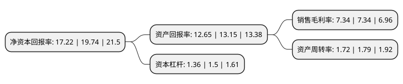

> 本页面由自动化程序生成于 2022年5月20日 01:36
> 内容可能存在错误，如有bug请提交issue至：https://github.com/Eroleice/doc-pi/issues
{.is-warning}

# 上市公司基本情况

## 基本资料

上海丽人丽妆化妆品股份有限公司（以下简称“丽人丽妆”）成立于2010年05月27日，上海市。于2020年09月29日在上交所主板上市。

丽人丽妆注册资本40,203万元，电商零售业务，品牌营销运营服务以下是详细信息：

- 公司名称: 上海丽人丽妆化妆品股份有限公司
- 股票代码: 605136.SH
- 所在地: 上海 - 上海市
- 成立日期: 2010年05月27日
- 注册资本: 40,203万元
- 法定代表人: 黄韬
- 主营业务: 电商零售业务，品牌营销运营服务
- 公司官网: www.lrlz.com
- 公司介绍: 公司是国内领先的化妆品网络零售服务商，是品牌方的重要合作伙伴和线上消费者的主要服务提供者之一，是联结品牌方和终端消费者的重要桥梁。公司主要从事电商零售业务和品牌营销运营服务。其中，电商零售业务是公司的核心业务。公司为品牌方提供覆盖店铺基础运营、页面视觉设计、产品设计策划、整合营销策划、精准推广投放、大数据分析、售前/售后客户服务、CRM及会员运营、仓储物流等多个环节的全链路网络零售综合服务，从而提高品牌线上零售的运营效率，助力品牌在线上渠道的价值重塑和销售转化，挖掘其市场潜力，提升其品牌形象与市场地位；同时，满足消费者对于优质正品和消费升级的诉求，并以个性化服务优化消费者的购物效率和体验。公司已经成为国内领先的化妆品网络零售服务商，积累了对互联网运营的深刻理解和运作经验，以专业的网络零售综合服务能力为品牌方促成销售实现，助力品牌方达成品牌影响力和市场地位的持续提升。公司已与美宝莲、施华蔻、兰芝、雅漾、雪花秀、相宜本草、雪肌精等超过60个品牌达成合作关系。

## 股东及高管情况

上市公司第一大股东为黄韬，持股133,980,304股，占比33.33%，为上市公司实际控制人。

截至2022年03月31日，上市公司的前十大股东中，共有1名自然人股东，6名机构股东，3个海外主体，其中5%以上大股东共有4名。上市公司前十大股东明细如下：

> 截至2022年03月31日，上市公司前十大股东信息如下：

| 股东名称 | 持股数量（股） | 持股比例 |
| --- | --- | --- |
| 黄韬 | 133,980,304 | 33.33% |
| 阿里巴巴(中国)网络技术有限公司 | 70,376,745 | 17.51% |
| Crescent Lily Singapore Pte. Ltd. | 34,671,026 | 8.62% |
| 上海丽仁创业投资合伙企业(有限合伙) | 31,367,739 | 7.8% |
| Milestone Ecom I(HK) Limited | 19,937,228 | 4.96% |
| Asia-Pacific E-Commerce Opportunities Pte. Ltd. | 16,667,228 | 4.15% |
| 深圳市领誉基石股权投资合伙企业(有限合伙) | 16,094,193 | 4% |
| 扬州丽秀创业投资合伙企业(有限合伙)(曾用名:上海丽秀创业投资合伙企业(有限合伙)) | 9,169,754 | 2.28% |
| 上海汉理前泰创业投资合伙企业(有限合伙) | 1,232,025 | 0.31% |
| 广发乾和投资有限公司 | 1,230,227 | 0.31% |

## 利润表分析

上市公司2021年总收入为41.54亿元，净利润为4.09亿元，实现盈利。

## 杜邦分析

> 数据列示周期：2020年 | 2019年 | 2018年
{.is-info}

上市公司的净资产收益率在近一年有所下降，下降幅度为-12.77%，其变化情况分解如下：
- 上市公司的销售毛利率在近一年下降了0%，可能是生产效率的下降、商品原材料价格上涨或商品价格的下跌所致。
- 上市公司的资产周转率在近一年下降了-3.91%，可能是源自于更慢的销售回款或库存管理效果下降。
- 上市公司的财务杠杆比率在近一年下降了-9.33%，可能是减少负债降低财务费用。

