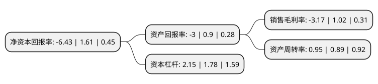

> 本页面由自动化程序生成于 2022年5月20日 01:02
> 内容可能存在错误，如有bug请提交issue至：https://github.com/Eroleice/doc-pi/issues
{.is-warning}

# 上市公司基本情况

## 基本资料

海螺(安徽)节能环保新材料股份有限公司（以下简称“海螺新材”）成立于1996年10月16日，芜湖市。于1996年10月23日在深交所主板上市。

海螺新材注册资本36,000万元，主要产品:型材，门窗以下是详细信息：

- 公司名称: 海螺(安徽)节能环保新材料股份有限公司
- 股票代码: 000619.SZ
- 所在地: 安徽 - 芜湖市
- 成立日期: 1996年10月16日
- 注册资本: 36,000万元
- 法定代表人: 万涌
- 主营业务: 主要产品:型材，门窗
- 公司官网: profile.conch.cn
- 公司介绍: 公司是中国安徽海螺集团投资控股的新型化学建材企业，是中国首家以塑料型材为主业的上市公司、科技部确定的重点高新技术企业。公司主要从事中高档塑料型材、板材、门窗的生产、销售以及科研开发，主要产品包括塑钢门窗异型材、彩色异型材等装饰异型材，是国际同行业产品品种最丰富的企业之一。以产销量计算，公司在国内、国际塑料型材行业稳居首位，公司产能规模位居世界前列。公司已构建了全国性市场销售网络，产品畅销全国各地，并出口至英国、德国、俄罗斯等国家。

## 股东及高管情况

上市公司第一大股东为安徽海螺集团有限责任公司，持股110,282,693股，占比30.63%，为上市公司实际控制人。

截至2022年03月31日，上市公司的前十大股东中，共有5名自然人股东，4名机构股东，1个产品账户，其中5%以上大股东共有1名。上市公司前十大股东明细如下：

> 截至2022年03月31日，上市公司前十大股东信息如下：

| 股东名称 | 持股数量（股） | 持股比例 |
| --- | --- | --- |
| 安徽海螺集团有限责任公司 | 110,282,693 | 30.63% |
| 熊立武 | 10,650,000 | 2.96% |
| 芜湖海螺国际大酒店有限公司 | 7,160,000 | 1.99% |
| 王昆 | 4,423,047 | 1.23% |
| 保宁资本有限公司-保宁新兴市场中小企基金(美国) | 3,366,600 | 0.94% |
| 浙江盾安人工环境股份有限公司 | 3,360,000 | 0.93% |
| 赵苗 | 3,150,000 | 0.88% |
| 安徽海螺投资有限责任公司 | 2,936,700 | 0.82% |
| 盛晟 | 2,695,600 | 0.75% |
| 钱江 | 1,802,600 | 0.5% |

## 利润表分析

上市公司2021年总收入为48.53亿元，净利润为-1.54亿元，**未实现盈利**。

## 杜邦分析

> 数据列示周期：2021年 | 2020年 | 2019年
{.is-info}

上市公司的净资产收益率在近一年有所下降，下降幅度为-499.38%，其变化情况分解如下：
- 上市公司的销售毛利率在近一年下降了-410.78%，可能是生产效率的下降、商品原材料价格上涨或商品价格的下跌所致。
- 上市公司的资产周转率在近一年上升了6.74%，可能是源自于更快的销售回款或库存管理效果提升。
- 上市公司的财务杠杆比率在近一年上升了20.79%，可能是增加负债扩大生产规模。

