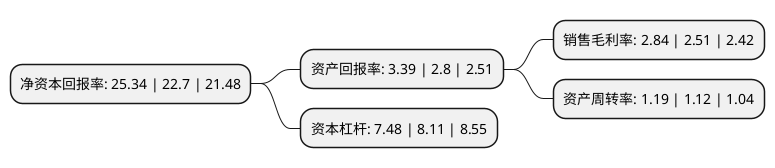

> 本页面由自动化程序生成于 2022年5月20日 01:05
> 内容可能存在错误，如有bug请提交issue至：https://github.com/Eroleice/doc-pi/issues
{.is-warning}

# 上市公司基本情况

## 基本资料

瑞泰科技股份有限公司（以下简称“瑞泰科技”）成立于2001年12月30日，北京市。于2006年08月23日在深交所中小板上市。

瑞泰科技注册资本23,100万元，主要产品分为熔铸锆刚玉和熔铸氧化铝两大系列五个品种以下是详细信息：

- 公司名称: 瑞泰科技股份有限公司
- 股票代码: 002066.SZ
- 所在地: 北京 - 北京市
- 成立日期: 2001年12月30日
- 注册资本: 23,100万元
- 法定代表人: 曾大凡
- 主营业务: 主要产品分为熔铸锆刚玉和熔铸氧化铝两大系列五个品种
- 公司官网: www.bjruitai.com
- 公司介绍: 公司是一家综合型耐火材料服务商。公司集研发、生产、销售和综合服务为一体，为玻璃、水泥、钢铁、有色、电力、石化、煤化工、危废处理等行业高温窑炉提供耐火技术、耐火材料、施工安装等综合服务。公司的生产规模、技术水平、产品质量、创新能力在行业名列前茅。公司可提供熔铸耐火材料、碱性耐火材料、铝硅质耐火材料、硅质耐火材料、特殊合金耐热耐磨材料等系列产品，在产品品种、服务领域、出口产品方面都具有较大优势。公司是国家“资源节约、环境友好两型企业”，此外公司还承担行业多项社会工作，是中国建材联合会耐火材料分会理事长单位、中国硅酸盐学会耐火材料分会理事长单位、中国耐火材料行业协会副会长单位、国家耐火材料标准委员会副主任单位、中国建筑玻璃与工业玻璃协会副会长单位、中国日用玻璃协会副理事长单位，在研究和探讨行业发展方向、规范行业秩序、为企业提供咨询服务等方面做出了积极贡献。

## 股东及高管情况

上市公司第一大股东为中国建筑材料科学研究总院有限公司，持股92,697,465股，占比40.13%，为上市公司实际控制人。

截至2022年03月31日，上市公司的前十大股东中，共有8名自然人股东，2名机构股东，其中5%以上大股东共有1名。上市公司前十大股东明细如下：

> 截至2022年03月31日，上市公司前十大股东信息如下：

| 股东名称 | 持股数量（股） | 持股比例 |
| --- | --- | --- |
| 中国建筑材料科学研究总院有限公司 | 92,697,465 | 40.13% |
| 中央汇金资产管理有限责任公司 | 6,146,200 | 2.66% |
| 张西萍 | 2,518,600 | 1.09% |
| 吴素芬 | 1,872,111 | 0.81% |
| 刘鹏 | 1,763,300 | 0.76% |
| 闫晗 | 1,604,000 | 0.69% |
| 张力 | 1,320,900 | 0.57% |
| 张方甫 | 1,211,100 | 0.52% |
| 庄瑛辉 | 1,182,300 | 0.51% |
| 吴桂英 | 1,158,200 | 0.5% |

## 利润表分析

上市公司2021年总收入为45.37亿元，净利润为1.28亿元，实现盈利。

## 杜邦分析

> 数据列示周期：2021年 | 2020年 | 2019年
{.is-info}

上市公司的净资产收益率在近一年有所上升，上升幅度为11.63%，其变化情况分解如下：
- 上市公司的销售毛利率在近一年上升了13.15%，可能是生产效率的提升、商品原材料价格下跌或商品价格的上涨所致。
- 上市公司的资产周转率在近一年上升了6.25%，可能是源自于更快的销售回款或库存管理效果提升。
- 上市公司的财务杠杆比率在近一年下降了-7.77%，可能是减少负债降低财务费用。

