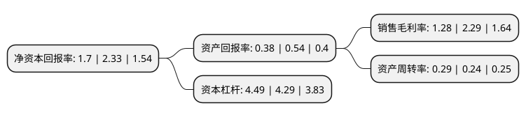

> 本页面由自动化程序生成于 2022年5月20日 01:07
> 内容可能存在错误，如有bug请提交issue至：https://github.com/Eroleice/doc-pi/issues
{.is-warning}

# 上市公司基本情况

## 基本资料

新疆国统管道股份有限公司（以下简称“国统股份”）成立于2001年08月30日，乌鲁木齐市。于2008年01月23日在深交所中小板上市。

国统股份注册资本18,584.323万元，PCCP的制造，运输及其异型管件，配件的开发制造，及其它管材产品的生产和经营。主要产品为PCCP。以下是详细信息：

- 公司名称: 新疆国统管道股份有限公司
- 股票代码: 002205.SZ
- 所在地: 新疆 - 乌鲁木齐市
- 成立日期: 2001年08月30日
- 注册资本: 18,584.323万元
- 法定代表人: 李鸿杰
- 主营业务: PCCP的制造，运输及其异型管件，配件的开发制造，及其它管材产品的生产和经营主要产品为PCCP
- 公司官网: www.xjgt.com
- 公司介绍: 公司是一家设计+投资+建设+运营管理和维护的能力齐备、结构合理、盈利水平较高的完整市场服务产业实体。公司主营业务为预应力钢筒混凝土管(PCCP)、各种输水管道及其异型管件和配件、钢筋混凝土管片(盾构管片)等水泥制品的制造、运输及相关的技术开发和咨询服务，主要产品为PCCP。PCCP广泛应用于跨流域引水、城际间输配水重点工程以及城市输水大中口径主干管网等国家水资源重要领域中，具有口径大、使用寿命长、耐腐蚀能力强、抗渗性强、密封性强、抗震能力强、维护成本低等突出优势。公司在立足PCCP主业的同时，积极参与水务领域建设、城市综合管廊、海绵城市等项目的投资、建设、运营，创新业务模式、创新经营模式，集合各种优势参与PPP业务。公司重视科技创新，加快产研结合、科技转化工作，吸收、引进了一批优秀的专业技术人才，形成复合型等全方位的技术团队，具有较强的自主研发能力。同时加强公司内部及行业沟通交流，通过不断加大对新材料、新工艺与新产品试制的研发力度，提高产品科技含量，降低生产成本，提升产业技术水平和产品的市场竞争力。

## 股东及高管情况

上市公司第一大股东为新疆天山建材(集团)有限责任公司，持股56,139,120股，占比30.21%，为上市公司实际控制人。

截至2022年03月31日，上市公司的前十大股东中，共有7名自然人股东，3名机构股东，其中5%以上大股东共有1名。上市公司前十大股东明细如下：

> 截至2022年03月31日，上市公司前十大股东信息如下：

| 股东名称 | 持股数量（股） | 持股比例 |
| --- | --- | --- |
| 新疆天山建材(集团)有限责任公司 | 56,139,120 | 30.21% |
| 付金华 | 5,337,920 | 2.87% |
| 郑宵峰 | 1,999,900 | 1.08% |
| 陈建建 | 1,831,460 | 0.99% |
| 吴爱德 | 1,826,400 | 0.98% |
| 新疆三联工程建设有限责任公司 | 1,289,856 | 0.69% |
| 赵育龙 | 1,209,080 | 0.65% |
| 詹冰洁 | 1,132,980 | 0.61% |
| 周宇光 | 1,000,182 | 0.54% |
| 山东华禾生物科技有限公司 | 971,900 | 0.52% |

## 杜邦分析

> 数据列示周期：2021年 | 2020年 | 2019年
{.is-info}

上市公司的净资产收益率在近一年有所下降，下降幅度为-27.04%，其变化情况分解如下：
- 上市公司的销售毛利率在近一年下降了-44.1%，可能是生产效率的下降、商品原材料价格上涨或商品价格的下跌所致。
- 上市公司的资产周转率在近一年上升了20.83%，可能是源自于更快的销售回款或库存管理效果提升。
- 上市公司的财务杠杆比率在近一年上升了4.66%，可能是增加负债扩大生产规模。

