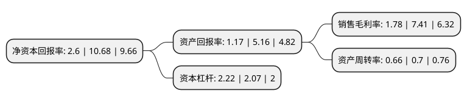

> 本页面由自动化程序生成于 2022年5月20日 01:07
> 内容可能存在错误，如有bug请提交issue至：https://github.com/Eroleice/doc-pi/issues
{.is-warning}

# 上市公司基本情况

## 基本资料

濮阳濮耐高温材料(集团)股份有限公司（以下简称“濮耐股份”）成立于2002年01月28日，濮阳市。于2008年04月25日在深交所中小板上市。

濮耐股份注册资本101,035.312万元，目前主营业务:研制，生产和销售定型，不定形耐火材料，功能耐火材料及配套机构，并承担各种热工设备耐火材料设计安装，施工服务等整体承包业务。主要产品:耐火材料制品。以下是详细信息：

- 公司名称: 濮阳濮耐高温材料(集团)股份有限公司
- 股票代码: 002225.SZ
- 所在地: 河南 - 濮阳市
- 成立日期: 2002年01月28日
- 注册资本: 101,035.312万元
- 法定代表人: 刘百宽
- 主营业务: 目前主营业务:研制，生产和销售定型，不定形耐火材料，功能耐火材料及配套机构，并承担各种热工设备耐火材料设计安装，施工服务等整体承包业务主要产品:耐火材料制品
- 公司官网: www.punai.com.cn
- 公司介绍: 公司是目前国内主要的功能耐火材料、不定形耐火材料生产企业之一，是国内主要的钢铁行业用耐火材料制品供应商，其拳头产品钢铁炉外精炼透气砖国内市场份额领先。公司主营业务为研制、生产和销售定型、不定形耐火材料、功能耐火材料及配套机构，并承担各种热工设备耐火材料设计安装、施工服务等整体承包业务，目前已为世界钢铁百强企业中的大多数提供优质产品和完善服务。主要产品包括透气砖类、座砖类、散料类、滑板水口类、三大件类、镁碳/铝镁碳类等多个系列品种的耐火材料，广泛应用于钢铁、有色冶炼、电力、石化、铸造等行业，并出口到美洲、欧洲、独联体国家、东南亚、非洲、中东等国家和地区。主导产品钢包底吹氩透气砖被定为国家级新产品，被列入国家级重点火炬计划。公司一直致力于耐火材料新技术、新产品的开发和推广应用，是国家认定的高新技术企业、国家创新型企业、河南省五十户高成长型高新技术企业、中国科技名牌500强企业。

## 股东及高管情况

上市公司第一大股东为刘百宽，持股132,245,727股，占比13.09%，**疑似为**上市公司实际控制人。

截至2022年03月31日，上市公司的前十大股东中，共有7名自然人股东，1名机构股东，2个产品账户，其中5%以上大股东共有3名。上市公司前十大股东明细如下：

> 未能通过持股比例判定出上市公司实际控制人（持股30%以上）
> 可能存在通过间接持股、联合持股、协议控制等方式拥有实际控制权的主体，具体请参考上市公司定期公告！
{.is-warning}

> 截至2022年03月31日，上市公司前十大股东信息如下：

| 股东名称 | 持股数量（股） | 持股比例 |
| --- | --- | --- |
| 刘百宽 | 132,245,727 | 13.09% |
| 刘百春 | 103,742,266 | 10.27% |
| 郭志彦 | 84,923,204 | 8.41% |
| 中央企业乡村产业投资基金股份有限公司 | 24,417,698 | 2.42% |
| 郑化轸 | 20,260,538 | 2.01% |
| 华安未来资管-杭州易可股权投资合伙企业(有限合伙)-华安资产智盈30号单一资产管理计划 | 16,610,747 | 1.64% |
| 史绪波 | 15,566,035 | 1.54% |
| 中央汇金资产管理有限责任公司 | 14,970,900 | 1.48% |
| 刘百庆 | 11,370,695 | 1.13% |
| 钟建一 | 11,327,989 | 1.12% |

## 利润表分析

上市公司2021年总收入为43.77亿元，净利润为0.78亿元，实现盈利。

## 杜邦分析

> 数据列示周期：2021年 | 2020年 | 2019年
{.is-info}

上市公司的净资产收益率在近一年有所下降，下降幅度为-75.66%，其变化情况分解如下：
- 上市公司的销售毛利率在近一年下降了-75.98%，可能是生产效率的下降、商品原材料价格上涨或商品价格的下跌所致。
- 上市公司的资产周转率在近一年下降了-5.71%，可能是源自于更慢的销售回款或库存管理效果下降。
- 上市公司的财务杠杆比率在近一年上升了7.25%，可能是增加负债扩大生产规模。

