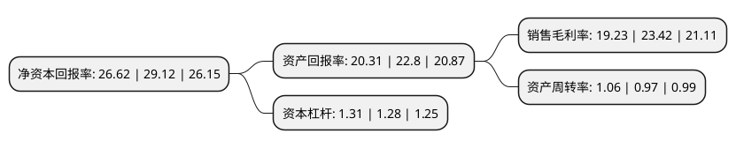

> 本页面由自动化程序生成于 2022年5月20日 01:08
> 内容可能存在错误，如有bug请提交issue至：https://github.com/Eroleice/doc-pi/issues
{.is-warning}

# 上市公司基本情况

## 基本资料

浙江伟星新型建材股份有限公司（以下简称“伟星新材”）成立于1999年10月12日，台州市。于2010年03月18日在深交所中小板上市。

伟星新材注册资本159,211.299万元，专业从事高质量，高附加值新型塑料管道的研发，生产和销售。主要产品为无规共聚聚丙烯(PPR)系列管材及管件，聚乙烯(PE)系列管材及管件，高密度聚乙烯(HDPE)双壁波纹管和聚丁烯(PB)管材管件等。以下是详细信息：

- 公司名称: 浙江伟星新型建材股份有限公司
- 股票代码: 002372.SZ
- 所在地: 浙江 - 台州市
- 成立日期: 1999年10月12日
- 注册资本: 159,211.299万元
- 法定代表人: 金红阳
- 主营业务: 专业从事高质量，高附加值新型塑料管道的研发，生产和销售主要产品为无规共聚聚丙烯(PPR)系列管材及管件，聚乙烯(PE)系列管材及管件，高密度聚乙烯(HDPE)双壁波纹管和聚丁烯(PB)管材管件等
- 公司官网: www.vasen.com
- 公司介绍: 公司是国内一家专业从事高质量、高附加值新型塑料管道的研发、制造和销售的企业，是国内PP-R管道的技术先驱与龙头企业。公司主要从事各类中高档新型塑料管道的制造与销售，产品分为三大系列：一是PPR系列管材管件，主要应用于建筑内冷热给水；二是PE系列管材管件，主要应用于市政供水、采暖、燃气、排水排污等领域；三是PVC系列管材管件，主要应用于排水排污、电力护套等领域。公司被认定为中国塑料加工工业协会第六届理事会副理事长单位，中国塑料加工工业协会塑料管道专业委员会第九届副理事长单位，中国塑料行业先进单位、高新技术企业、浙江省专利示范企业、浙江省创新型示范企业、浙江省工商企业信用AAA级“守合同重信用”单位、浙江省首批标准创新型企业、浙江省绿色企业、台州市专利示范企业，也是国内塑料管道行业为数不多的上市公司之一。

## 股东及高管情况

上市公司第一大股东为伟星集团有限公司，持股603,359,564股，占比37.9%，为上市公司实际控制人。

截至2022年03月31日，上市公司的前十大股东中，共有3名自然人股东，2名机构股东，3个产品账户，1个海外主体，1名其他股东，其中5%以上大股东共有4名。上市公司前十大股东明细如下：

> 截至2022年03月31日，上市公司前十大股东信息如下：

| 股东名称 | 持股数量（股） | 持股比例 |
| --- | --- | --- |
| 伟星集团有限公司 | 603,359,564 | 37.9% |
| 临海慧星集团有限公司 | 262,800,000 | 16.51% |
| 香港中央结算有限公司(陆股通) | 147,159,843 | 9.24% |
| 章卡鹏 | 82,538,434 | 5.18% |
| 张三云 | 31,269,218 | 1.96% |
| 首域投资管理(英国)有限公司-首域中国A股基金 | 26,911,885 | 1.69% |
| 大成基金管理有限公司-社保基金1101组合 | 19,661,984 | 1.23% |
| 中国农业银行股份有限公司-大成高新技术产业股票型证券投资基金 | 18,483,294 | 1.16% |
| 香港金融管理局-自有资金 | 18,214,265 | 1.14% |
| 金红阳 | 16,563,013 | 1.04% |

## 利润表分析

上市公司2021年总收入为63.87亿元，净利润为12.28亿元，实现盈利。

## 杜邦分析

> 数据列示周期：2021年 | 2020年 | 2019年
{.is-info}

上市公司的净资产收益率在近一年有所下降，下降幅度为-8.59%，其变化情况分解如下：
- 上市公司的销售毛利率在近一年下降了-17.89%，可能是生产效率的下降、商品原材料价格上涨或商品价格的下跌所致。
- 上市公司的资产周转率在近一年上升了9.28%，可能是源自于更快的销售回款或库存管理效果提升。
- 上市公司的财务杠杆比率在近一年上升了2.34%，可能是增加负债扩大生产规模。

